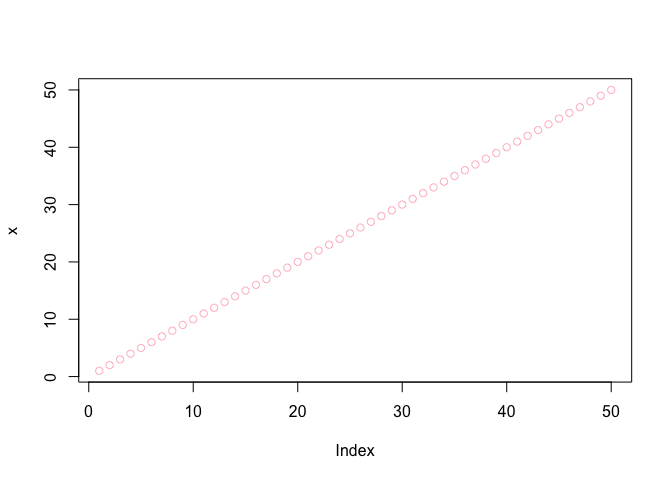
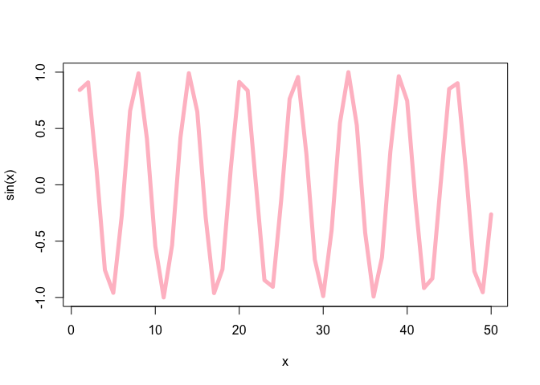
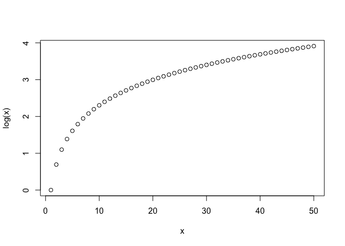

# Lab 4
Emily Chase (PID: A14656894)
2025-10-10

``` r
# our first script
print("hello world")
```

    [1] "hello world"

``` r
x <- 1:50

plot(x)
```


``` r
plot(x, col='pink')
```



``` r
plot(x, sin(x), col='pink', typ="l", lwd="5")
```



``` r
log(10, base=10)
```

    [1] 1

``` r
plot(x, log(x))
```



``` r
log10(10)
```

    [1] 1
