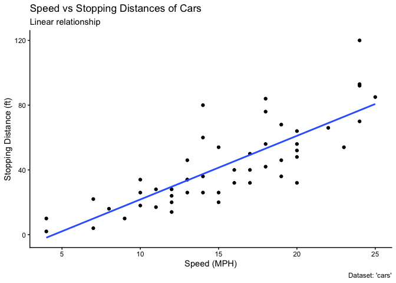
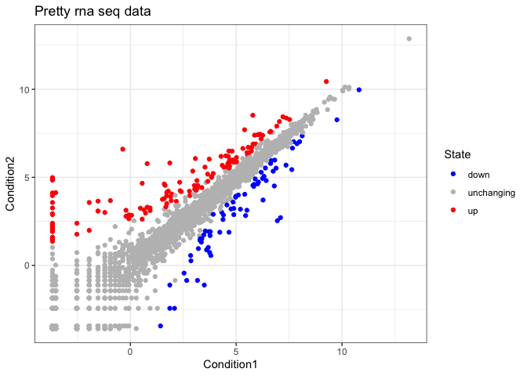
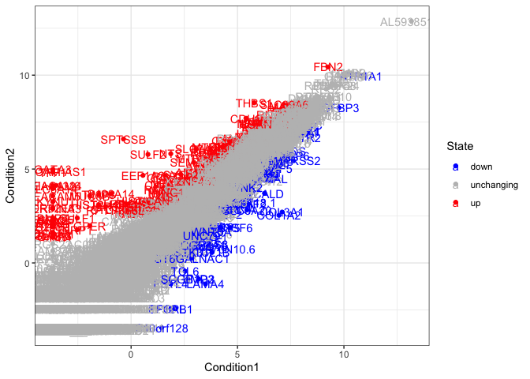
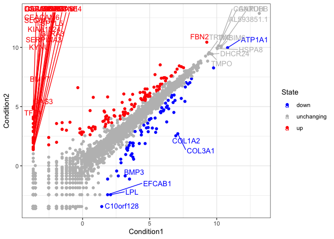
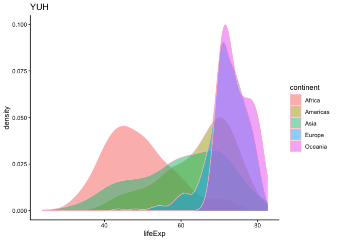

# Class05: Data Viz with ggplot
Emily Chase (PID: A14656894)

Today we are playing with (gg)-plotting and graphics.

There are *loads* of ways to make cool figures in R.

- There is “base” R graphics (`plot()`, `hist()`, `boxplot()`, etc)

- There are also add-on packages like **ggplot**

``` r
# cars --> prints the entire thing when rendered
head(cars, 5)
```

      speed dist
    1     4    2
    2     4   10
    3     7    4
    4     7   22
    5     8   16

## Let’s plot this with “base” R:

``` r
plot(cars)
```


Let’s plot `mpg` vs `disp`

``` r
plot(mtcars$mpg, mtcars$disp)
```


``` r
hist(mtcars$mpg)
```


## Now: ggplot

The main function in the ggplot2 package is `ggplot()`. First step if
never used before is to install via
`install.package(<package_you_want>)`. You can put this in quarto but
every time you render it’ll install the software, so you should do it in
the R console. I’ve already installed this so now I just want to load it
in.

``` r
library(ggplot2)
```

    Warning: package 'ggplot2' was built under R version 4.5.2

``` r
ggplot(cars) + 
  aes(x=speed, y=dist) + 
  geom_point() 
```


Every ggplot needs - **data** layer - **aesthetic** layer - **geom**
layer

## Adding more layers

Add a line?

``` r
ggplot(cars) + 
  aes(x=speed, y=dist) + 
  geom_point() +
  geom_line()
```


…What about a fit line?

``` r
ggplot(cars) + 
  aes(x=speed, y=dist) + 
  geom_point() +
  geom_smooth()
```

    `geom_smooth()` using method = 'loess' and formula = 'y ~ x'


``` r
cars
```

       speed dist
    1      4    2
    2      4   10
    3      7    4
    4      7   22
    5      8   16
    6      9   10
    7     10   18
    8     10   26
    9     10   34
    10    11   17
    11    11   28
    12    12   14
    13    12   20
    14    12   24
    15    12   28
    16    13   26
    17    13   34
    18    13   34
    19    13   46
    20    14   26
    21    14   36
    22    14   60
    23    14   80
    24    15   20
    25    15   26
    26    15   54
    27    16   32
    28    16   40
    29    17   32
    30    17   40
    31    17   50
    32    18   42
    33    18   56
    34    18   76
    35    18   84
    36    19   36
    37    19   46
    38    19   68
    39    20   32
    40    20   48
    41    20   52
    42    20   56
    43    20   64
    44    22   66
    45    23   54
    46    24   70
    47    24   92
    48    24   93
    49    24  120
    50    25   85

``` r
ggplot(cars) + 
  aes(x=speed, y=dist) + 
  geom_point() +
  labs(title="Speed vs Stopping Distances of Cars",
       x="Speed (MPH)",
       y="Stopping Distance (ft)",
       subtitle="Linear relationship",
       caption="Dataset: 'cars'")   +
  geom_smooth(method="lm", se=FALSE) +
  theme_classic()
```

    `geom_smooth()` using formula = 'y ~ x'



## Now we will plot some expression data

``` r
url <- "https://bioboot.github.io/bimm143_S20/class-material/up_down_expression.txt"
genes <- read.delim(url)
head(genes)
```

            Gene Condition1 Condition2      State
    1      A4GNT -3.6808610 -3.4401355 unchanging
    2       AAAS  4.5479580  4.3864126 unchanging
    3      AASDH  3.7190695  3.4787276 unchanging
    4       AATF  5.0784720  5.0151916 unchanging
    5       AATK  0.4711421  0.5598642 unchanging
    6 AB015752.4 -3.6808610 -3.5921390 unchanging

> Q1 How many genes are in this wee dataset?

There are 5196 in this dataset

``` r
nrow(genes)
```

    [1] 5196

> Q2 How many columns and what are their names?

``` r
colnames(genes)
```

    [1] "Gene"       "Condition1" "Condition2" "State"     

``` r
ncol(genes)
```

    [1] 4

> Q3 How many up-regulated genes are there?

``` r
sum(genes$State == "up") # returns logicals in the df, then sum it
```

    [1] 127

``` r
# another way to get the number of occurences of things in a vector
table(genes$State)
```


          down unchanging         up 
            72       4997        127 

> Q4 What percentage of genes are upregulated?

``` r
tot_up = sum(genes$State == "up")
pct_up = tot_up/nrow(genes) * 100
print(pct_up)
```

    [1] 2.444188

> Plot the up/down regulated genes

``` r
ggplot(genes) +
  aes(Condition1, Condition2, color=State) +
  geom_point()
```


``` r
p <- ggplot(genes) +
  aes(Condition1, Condition2, color=State) +
  geom_point() + 
  scale_color_manual(values=c("blue", "grey", "red")) +
  theme_bw()
p
```


``` r
p+labs(title="Pretty rna seq data") 
```



## What if we added labels in aesthetic mappings?

``` r
ggplot(genes) +
  aes(Condition1, Condition2, color=State, label=Gene) +
  geom_point() + 
  scale_color_manual(values=c("blue", "grey", "red")) +
  theme_bw() +
  geom_text()
```



Yoinks

### Let’s install a package that will help with labels

`install.packages("ggrepel")`

``` r
library(ggrepel)
```

``` r
ggplot(genes) +
  aes(Condition1, Condition2, color=State, label=Gene) +
  geom_point() + 
  scale_color_manual(values=c("blue", "grey", "red")) +
  theme_bw() +
  geom_text_repel(max.overlaps = 50)
```

    Warning: ggrepel: 5157 unlabeled data points (too many overlaps). Consider
    increasing max.overlaps



## Making panels:

``` r
# File location online
url <- "https://raw.githubusercontent.com/jennybc/gapminder/master/inst/extdata/gapminder.tsv"

gapminder <- read.delim(url)
```

``` r
tail(gapminder)
```

          country continent year lifeExp      pop gdpPercap
    1699 Zimbabwe    Africa 1982  60.363  7636524  788.8550
    1700 Zimbabwe    Africa 1987  62.351  9216418  706.1573
    1701 Zimbabwe    Africa 1992  60.377 10704340  693.4208
    1702 Zimbabwe    Africa 1997  46.809 11404948  792.4500
    1703 Zimbabwe    Africa 2002  39.989 11926563  672.0386
    1704 Zimbabwe    Africa 2007  43.487 12311143  469.7093

``` r
ggplot(gapminder) +
  aes(gdpPercap, lifeExp, color=continent, size=pop) +
  geom_point(alpha=0.5) +
  facet_wrap(~continent) +
  theme_bw()
```


``` r
ggplot(gapminder) +
  aes(lifeExp, fill=continent, size=pop) +
  geom_density(alpha=0.5, color="pink") +
  theme_classic() +
  labs(title="YUH")
```

    Warning: Using `size` aesthetic for lines was deprecated in ggplot2 3.4.0.
    ℹ Please use `linewidth` instead.

    Warning: The following aesthetics were dropped during statistical transformation: size.
    ℹ This can happen when ggplot fails to infer the correct grouping structure in
      the data.
    ℹ Did you forget to specify a `group` aesthetic or to convert a numerical
      variable into a factor?


