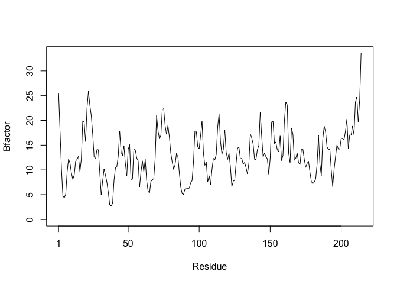
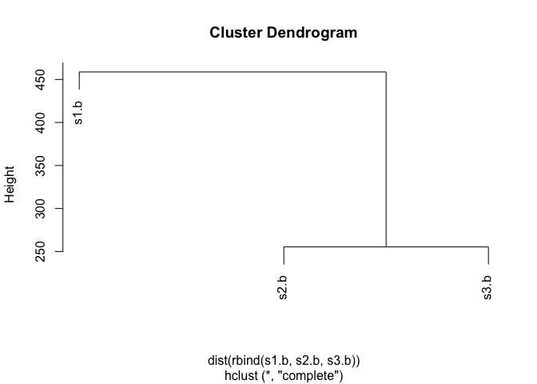

# HW: Class 06
Emily Chase (PID: A14656894)

- [Section 1: Improving analysis code by writing
  functions](#section-1-improving-analysis-code-by-writing-functions)
  - [(A) Can you improve this analysis
    code?](#a-can-you-improve-this-analysis-code)
    - [Improved:](#improved)
    - [Even cleaner](#even-cleaner)
  - [(B) Improve another code chunk, then answer
    Q1-6](#b-improve-another-code-chunk-then-answer-q1-6)
    - [Improve the code](#improve-the-code)

# Section 1: Improving analysis code by writing functions

## (A) Can you improve this analysis code?

``` r
df <- data.frame(a=1:10, b=seq(200,400,length=10),c=11:20,d=NA)

head(df)
```

      a        b  c  d
    1 1 200.0000 11 NA
    2 2 222.2222 12 NA
    3 3 244.4444 13 NA
    4 4 266.6667 14 NA
    5 5 288.8889 15 NA
    6 6 311.1111 16 NA

``` r
df$a <- (df$a - min(df$a)) / (max(df$a) - min(df$a))
df$b <- (df$b - min(df$a)) / (max(df$b) - min(df$b))
df$c <- (df$c - min(df$c)) / (max(df$c) - min(df$c))
df$d <- (df$d - min(df$d)) / (max(df$a) - min(df$d)) 

head(df)
```

              a        b         c  d
    1 0.0000000 1.000000 0.0000000 NA
    2 0.1111111 1.111111 0.1111111 NA
    3 0.2222222 1.222222 0.2222222 NA
    4 0.3333333 1.333333 0.3333333 NA
    5 0.4444444 1.444444 0.4444444 NA
    6 0.5555556 1.555556 0.5555556 NA

### Improved:

``` r
# initiate the df
df <- data.frame(a=1:10, b=seq(200,400,length=10),c=11:20,d=NA)

# define a function
scale_down <- function(x){
  ans <- (x - min(x)) / (max(x) - min(x))
  return(ans)
  
}

# loop the function 
for (col in colnames(df)){
  df[[col]] <- scale_down(df[[col]])
}

head(df)
```

              a         b         c  d
    1 0.0000000 0.0000000 0.0000000 NA
    2 0.1111111 0.1111111 0.1111111 NA
    3 0.2222222 0.2222222 0.2222222 NA
    4 0.3333333 0.3333333 0.3333333 NA
    5 0.4444444 0.4444444 0.4444444 NA
    6 0.5555556 0.5555556 0.5555556 NA

### Even cleaner

``` r
# initiate the df
df <- data.frame(a=1:10, b=seq(200,400,length=10),c=11:20,d=NA)

# define a function
scale_down2 <- function(x){
  ans <- (x - min(x)) / (max(x) - min(x))
  return(ans)
  
}

# apply() the function 

df_scaled <- as.data.frame(lapply(df, scale_down2))
head(df_scaled)
```

              a         b         c  d
    1 0.0000000 0.0000000 0.0000000 NA
    2 0.1111111 0.1111111 0.1111111 NA
    3 0.2222222 0.2222222 0.2222222 NA
    4 0.3333333 0.3333333 0.3333333 NA
    5 0.4444444 0.4444444 0.4444444 NA
    6 0.5555556 0.5555556 0.5555556 NA

## (B) Improve another code chunk, then answer Q1-6

``` r
# install.packages("bio3d") # run in console
library(bio3d)
s1 <- read.pdb("4AKE") # kinase with drug
```

      Note: Accessing on-line PDB file

``` r
s2 <- read.pdb("1AKE") # kinase no drug
```

      Note: Accessing on-line PDB file
       PDB has ALT records, taking A only, rm.alt=TRUE

``` r
s3 <- read.pdb("1E4Y") # kinase with drug
```

      Note: Accessing on-line PDB file

``` r
s1.chainA <- trim.pdb(s1, chain="A", elety="CA")
s2.chainA <- trim.pdb(s2, chain="A", elety="CA")
s3.chainA <- trim.pdb(s3, chain="A", elety="CA")
s1.b <- s1.chainA$atom$b
s2.b <- s2.chainA$atom$b
s3.b <- s3.chainA$atom$b
plotb3(s1.b, sse=s1.chainA, typ="l", ylab="Bfactor")
```


``` r
plotb3(s2.b, sse=s2.chainA, typ="l", ylab="Bfactor")
```


``` r
plotb3(s3.b, sse=s3.chainA, typ="l", ylab="Bfactor")
```


### Improve the code

``` r
protein_drug_analysis <- function(kin) {
  "
  Function takes:
  kin - character string; PDB identifier
  
  Function returns:
  B factor vector of chain A alpha carbons
  
  Notes: bio3d must be loaded prior to running
  "

  # read pdb
  seq <-  read.pdb(kin)
  ## trim
  seq.chainA <- trim.pdb(seq, chain="A", elety="CA")
  ## initiate new variables
  seq.atomB <- seq.chainA$atom$b
  # plot the new variables
  plotb3(seq.atomB, sse=seq.chainA, typ="l", ylab="Bfactor") 
  # return B factor vector for downstream analysis
  return(seq.atomB)
  }
```

``` r
# load library?
library(bio3d)
protein_drug_analysis("4AKE")
```

      Note: Accessing on-line PDB file

    Warning in get.pdb(file, path = tempdir(), verbose = FALSE):
    /var/folders/_g/zld42jzs0xs93g_n840wkdb00000gn/T//Rtmp1lYyav/4AKE.pdb exists.
    Skipping download


      [1]  29.02  18.44  16.20  19.67  20.26  20.55  17.05  22.13  26.71  33.05
     [11]  30.66  32.73  25.61  33.19  41.03  24.09  16.18  19.14  29.19  14.79
     [21]  19.63  28.54  27.49  32.56  17.13  15.50   6.98  24.07  24.00  23.94
     [31]  30.70  24.70  32.84  34.60  33.01  44.60  50.74  57.32  47.04  67.13
     [41]  81.04  75.20  59.68  55.63  45.12  39.04  44.31  38.21  43.70  44.19
     [51]  47.00  48.67  41.54  50.22  45.07  49.77  52.04  44.82  39.75  35.79
     [61]  38.92  37.93  27.18  26.86  27.53  31.16  27.08  23.03  28.12  24.78
     [71]  24.22  18.69  40.67  38.08  55.26  46.29  26.25  37.14  27.50  16.86
     [81]  27.76  19.27  22.22  26.70  25.52  21.22  15.90  15.84  22.44  19.61
     [91]  21.23  21.79  17.64  22.19  22.73  16.80  23.25  35.95  24.42  20.96
    [101]  20.00  25.99  24.39  17.19  12.16  17.35  24.97  14.08  22.01  22.26
    [111]  22.78  27.47  30.49  32.02  20.90  27.03  23.84  44.37  42.47  33.48
    [121]  44.56  56.67  60.18  66.62  59.95  70.81  88.63 100.11  86.60  85.80
    [131]  77.48  68.13  52.66  45.34  52.43  60.90  62.64  72.19  66.75  58.73
    [141]  74.57  79.29  79.53  76.58  66.40  64.76  70.48  74.84  70.11  74.82
    [151]  78.61  78.24  66.70  66.10  67.01  72.28  80.64  68.54  43.23  51.24
    [161]  45.72  61.60  45.61  42.57  41.03  41.02  33.34  19.48  34.38  33.11
    [171]  25.48  29.68  40.71  32.91  24.41  19.20  15.43  19.93  20.66  12.72
    [181]  21.40  18.21  26.68  34.50  25.77  26.52  36.85  31.05  39.84  48.03
    [191]  23.04  29.57  23.00  23.80  26.59  25.49  23.25  19.89  32.37  30.97
    [201]  42.16  29.64  29.69  33.15  26.38  23.17  29.35  32.80  25.92  38.01
    [211]  45.95  44.26  44.35  70.26

``` r
protein_drug_analysis("1AKE")
```

      Note: Accessing on-line PDB file

    Warning in get.pdb(file, path = tempdir(), verbose = FALSE):
    /var/folders/_g/zld42jzs0xs93g_n840wkdb00000gn/T//Rtmp1lYyav/1AKE.pdb exists.
    Skipping download

       PDB has ALT records, taking A only, rm.alt=TRUE


      [1] 37.14 25.76 23.90 17.83 19.86 21.75 20.21 16.92 17.47 18.35 18.31 20.57
     [13] 14.56 17.87 11.87 24.63 21.29 35.13 29.68 23.96 32.34 35.34 35.64 38.91
     [25] 29.00 36.55 28.83 27.15 30.28 28.13 19.90 21.95 25.07 16.15 18.35 21.19
     [37] 27.13 28.55 21.10 38.88 33.63 29.51 29.21 33.01 20.92 17.17 25.84 29.80
     [49] 16.89 24.66 35.62 23.52 23.37 34.41 25.96 16.79 20.20 23.72 23.29 25.23
     [61] 19.81 19.00 20.21 22.62 21.40 23.47 23.20 20.21 25.90 30.58 28.25 37.60
     [73] 44.66 54.46 91.10 92.02 86.85 80.21 68.72 42.01 27.69 23.06 21.98 18.60
     [85] 20.17 15.06 14.20 23.07 20.36 25.76 17.02 13.71 23.88 26.72 22.58 24.51
     [97] 45.23 38.07 36.97 35.17 37.83 43.69 29.14 24.56 25.20 19.27 20.88 18.27
    [109] 16.96 21.38 18.33 23.18 21.15 21.97 22.63  9.74 16.71 26.18 30.39 22.95
    [121] 25.51 20.28 16.86 21.94 20.59 21.64 27.42 35.72 23.47 31.57 23.71 19.01
    [133] 21.52 19.40 24.32 34.28 23.96 23.14 26.60 24.94 28.49 28.18 41.64 23.85
    [145] 28.67 28.76 35.16 35.46 28.74 26.99 31.74 40.41 33.73 25.57 29.13 29.74
    [157] 36.32 22.58 22.82 46.67 29.44 25.40 17.27 20.38 21.55 19.19 15.89 18.37
    [169] 30.51 18.47 11.70 18.45 24.75 16.63 20.80 19.62 22.56 19.87 20.22 21.16
    [181] 22.13 20.66 22.82 32.86 26.04 20.60 44.44 35.28 38.03 28.46 29.10 30.19
    [193] 26.17 22.71 23.39 23.44 16.27 21.26 24.67 19.12 23.26 21.75 24.59 27.26
    [205] 22.63 26.40 31.60 29.57 30.90 32.29 46.86 41.73 49.31 66.76

``` r
protein_drug_analysis("1E4Y")
```

      Note: Accessing on-line PDB file

    Warning in get.pdb(file, path = tempdir(), verbose = FALSE):
    /var/folders/_g/zld42jzs0xs93g_n840wkdb00000gn/T//Rtmp1lYyav/1E4Y.pdb exists.
    Skipping download


      [1] 25.46 17.86 10.28  4.73  4.36  5.10  9.59 12.19 11.41  9.39  8.08  9.01
     [13] 11.77 12.15 12.72  9.62 12.18 19.95 19.59 15.73 22.51 25.87 23.08 20.97
     [25] 17.28 12.69 12.24 14.14 14.05  9.38  5.03  7.78 10.13  8.96  7.50  5.48
     [37]  2.97  2.73  3.23  7.81 10.40 10.67 12.79 17.90 13.56 12.94 14.78 11.31
     [49]  8.79 14.13 15.10  7.92  8.15 14.28 14.04 12.42 11.84  6.57  9.59 11.84
     [61]  9.61 12.18  7.89  5.74  5.31  7.67  7.99  8.24 12.34 20.98 17.93 16.30
     [73] 16.94 22.19 22.36 18.96 17.18 18.99 16.65 13.39 11.61 10.10 11.03 13.31
     [85] 12.66  9.44  6.60  5.20  5.06  6.16  6.20  6.24  6.34  7.39  7.86 11.66
     [97] 17.87 17.67 14.63 14.30 16.98 19.84 13.36 10.93 11.52  7.56  8.85  7.07
    [109] 10.08 12.34 12.05 13.10 18.63 21.34 15.73 13.16 14.04 18.13 13.59 12.12
    [121] 13.37 10.57  6.60  7.73  7.91 11.31 14.38 14.60 12.25 12.33 11.10 11.53
    [133] 10.44  9.18 11.36 17.28 16.45 15.21 12.11 12.12 14.10 14.94 21.72 16.82
    [145] 12.61 13.40 12.64 12.24  9.13 12.31 19.68 19.83 15.34 15.61 14.07 13.64
    [157] 16.87 11.89 12.92 19.93 23.72 23.13 13.35 11.51 18.51 17.24 11.92 12.36
    [169] 13.42 11.45 11.09 14.19 14.22 12.15 10.49 11.29 11.74  9.53  7.65  7.21
    [181]  7.56  8.14 11.07 16.93 11.12  8.79 16.03 18.87 17.72 14.72 14.08 14.21
    [193]  9.99  6.63 10.11 12.64 15.06 14.21 14.20 16.39 16.31 16.07 17.83 20.24
    [205] 14.28 17.10 17.00 18.88 17.13 23.68 24.72 19.74 24.12 33.57

> Q1 What type of object is returned from the read.pdb() function?

``` r
typeof(s1)
```

    [1] "list"

read.pdb() returns a list

> Q2 What does the trim.pdb() function do?

``` r
s1
```


     Call:  read.pdb(file = "4AKE")

       Total Models#: 1
         Total Atoms#: 3459,  XYZs#: 10377  Chains#: 2  (values: A B)

         Protein Atoms#: 3312  (residues/Calpha atoms#: 428)
         Nucleic acid Atoms#: 0  (residues/phosphate atoms#: 0)

         Non-protein/nucleic Atoms#: 147  (residues: 147)
         Non-protein/nucleic resid values: [ HOH (147) ]

       Protein sequence:
          MRIILLGAPGAGKGTQAQFIMEKYGIPQISTGDMLRAAVKSGSELGKQAKDIMDAGKLVT
          DELVIALVKERIAQEDCRNGFLLDGFPRTIPQADAMKEAGINVDYVLEFDVPDELIVDRI
          VGRRVHAPSGRVYHVKFNPPKVEGKDDVTGEELTTRKDDQEETVRKRLVEYHQMTAPLIG
          YYSKEAEAGNTKYAKVDGTKPVAEVRADLEKILGMRIILLGAPGA...<cut>...KILG

    + attr: atom, xyz, seqres, helix, sheet,
            calpha, remark, call

``` r
s1.chainA
```


     Call:  trim.pdb(pdb = s1, chain = "A", elety = "CA")

       Total Models#: 1
         Total Atoms#: 214,  XYZs#: 642  Chains#: 1  (values: A)

         Protein Atoms#: 214  (residues/Calpha atoms#: 214)
         Nucleic acid Atoms#: 0  (residues/phosphate atoms#: 0)

         Non-protein/nucleic Atoms#: 0  (residues: 0)
         Non-protein/nucleic resid values: [ none ]

       Protein sequence:
          MRIILLGAPGAGKGTQAQFIMEKYGIPQISTGDMLRAAVKSGSELGKQAKDIMDAGKLVT
          DELVIALVKERIAQEDCRNGFLLDGFPRTIPQADAMKEAGINVDYVLEFDVPDELIVDRI
          VGRRVHAPSGRVYHVKFNPPKVEGKDDVTGEELTTRKDDQEETVRKRLVEYHQMTAPLIG
          YYSKEAEAGNTKYAKVDGTKPVAEVRADLEKILG

    + attr: atom, helix, sheet, seqres, xyz,
            calpha, call

trim.pdb() selects a subset of atoms from an initial PDB object.

> Q3 What input parameter would turn off the marginal black and grey
> rectangles in the plots and what do they represent in this case?

``` r
args(plotb3)
```

    function (x, resno = NULL, rm.gaps = FALSE, type = "h", main = "", 
        sub = "", xlim = NULL, ylim = NULL, ylim2zero = TRUE, xlab = "Residue", 
        ylab = NULL, axes = TRUE, ann = par("ann"), col = par("col"), 
        sse = NULL, sse.type = "classic", sse.min.length = 5, top = TRUE, 
        bot = TRUE, helix.col = "gray20", sheet.col = "gray80", sse.border = FALSE, 
        ...) 
    NULL

``` r
plotb3(s3.b, sse=s3.chainA, typ="l", ylab="Bfactor", top=FALSE, bot=FALSE)
```



`top=FALSE, bot=FALSE` would turn off the rectangles, which represent
secondary structures alpha helix and beta sheet.

> Q4 What would be a better plot to compare across the different
> proteins?

I think a plot that overlayed the proteins by residue would be best for
comparison.

> Q5 Which proteins are more similar to each other in their B-factor
> trends. How could you quantify this?

``` r
hc <- hclust( dist( rbind(s1.b, s2.b, s3.b) ) )
plot(hc)
```



According to documentation, `rbind()` combines the matrices, `dist()`
computes the pairwise distance and `hclust()` performs clustering based
on these distances.

By plotting we can see that s2 and s3 are more similar.

> Q6 How would you generalize the original code above to work with any
> set of input protein structures?

``` r
gen_protein_drug_analysis <- function(pdb_id, chain="A", elety="CA") {
  "
  Function takes:
  kin - character string; PDB identifier
  
  Function returns:
  B factor vector of a PDB protein
  
  Notes: bio3d must be loaded prior to running
  "

  # read pdb
  seq <-  read.pdb(pdb_id)
  ## trim
  seq.chainA <- trim.pdb(seq, chain=chain, elety=elety)
  ## initiate new variables
  seq.atomB <- seq.chainA$atom$b
  # plot the new variables
  plotb3(seq.atomB, sse=seq.chainA, typ="l", ylab="Bfactor") 
  # return B factor vector for downstream analysis
  return(seq.atomB)
  }
```

``` r
gen_protein_drug_analysis("4AKE")
```

      Note: Accessing on-line PDB file

    Warning in get.pdb(file, path = tempdir(), verbose = FALSE):
    /var/folders/_g/zld42jzs0xs93g_n840wkdb00000gn/T//Rtmp1lYyav/4AKE.pdb exists.
    Skipping download


      [1]  29.02  18.44  16.20  19.67  20.26  20.55  17.05  22.13  26.71  33.05
     [11]  30.66  32.73  25.61  33.19  41.03  24.09  16.18  19.14  29.19  14.79
     [21]  19.63  28.54  27.49  32.56  17.13  15.50   6.98  24.07  24.00  23.94
     [31]  30.70  24.70  32.84  34.60  33.01  44.60  50.74  57.32  47.04  67.13
     [41]  81.04  75.20  59.68  55.63  45.12  39.04  44.31  38.21  43.70  44.19
     [51]  47.00  48.67  41.54  50.22  45.07  49.77  52.04  44.82  39.75  35.79
     [61]  38.92  37.93  27.18  26.86  27.53  31.16  27.08  23.03  28.12  24.78
     [71]  24.22  18.69  40.67  38.08  55.26  46.29  26.25  37.14  27.50  16.86
     [81]  27.76  19.27  22.22  26.70  25.52  21.22  15.90  15.84  22.44  19.61
     [91]  21.23  21.79  17.64  22.19  22.73  16.80  23.25  35.95  24.42  20.96
    [101]  20.00  25.99  24.39  17.19  12.16  17.35  24.97  14.08  22.01  22.26
    [111]  22.78  27.47  30.49  32.02  20.90  27.03  23.84  44.37  42.47  33.48
    [121]  44.56  56.67  60.18  66.62  59.95  70.81  88.63 100.11  86.60  85.80
    [131]  77.48  68.13  52.66  45.34  52.43  60.90  62.64  72.19  66.75  58.73
    [141]  74.57  79.29  79.53  76.58  66.40  64.76  70.48  74.84  70.11  74.82
    [151]  78.61  78.24  66.70  66.10  67.01  72.28  80.64  68.54  43.23  51.24
    [161]  45.72  61.60  45.61  42.57  41.03  41.02  33.34  19.48  34.38  33.11
    [171]  25.48  29.68  40.71  32.91  24.41  19.20  15.43  19.93  20.66  12.72
    [181]  21.40  18.21  26.68  34.50  25.77  26.52  36.85  31.05  39.84  48.03
    [191]  23.04  29.57  23.00  23.80  26.59  25.49  23.25  19.89  32.37  30.97
    [201]  42.16  29.64  29.69  33.15  26.38  23.17  29.35  32.80  25.92  38.01
    [211]  45.95  44.26  44.35  70.26
