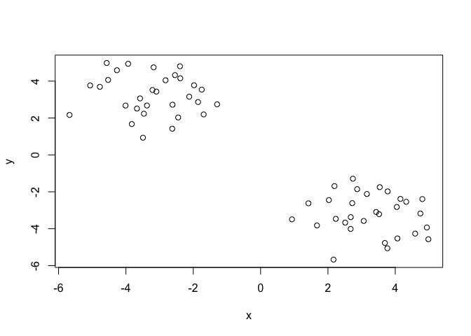
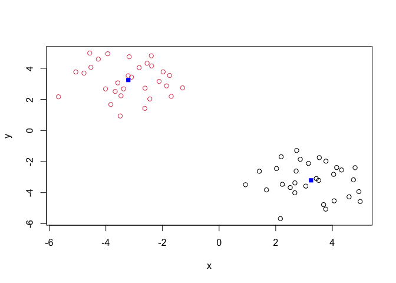
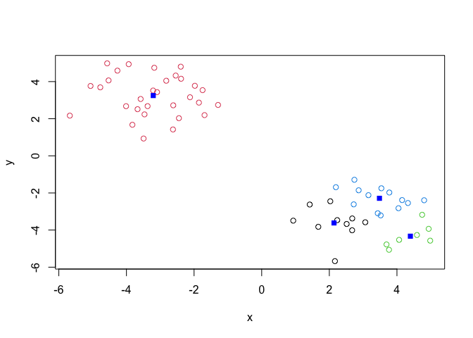
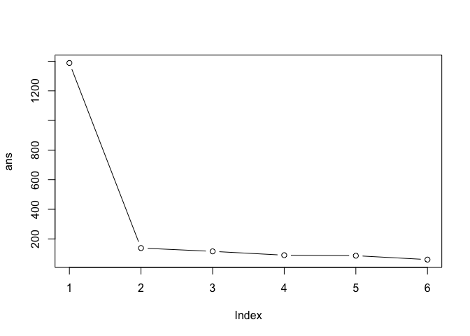
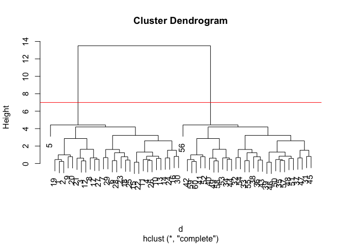
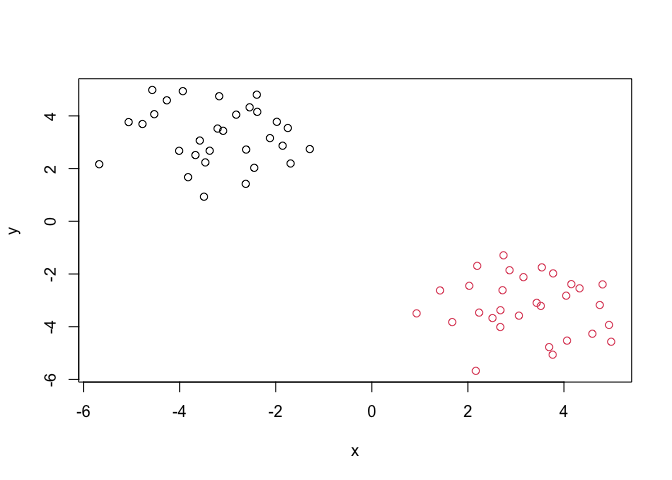
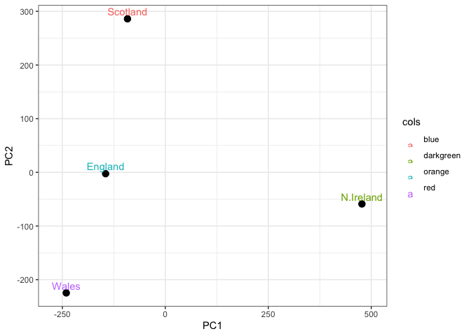

# Class 7: Machine Learning 1
Emily Chase (PID: A14656894)

- [Hierarchical Clustering](#hierarchical-clustering)
- [Principal Component Analysis](#principal-component-analysis)
  - [Hands-on Worksheet](#hands-on-worksheet)
  - [PCA to the rescue](#pca-to-the-rescue)

Today we will begin to learn “classical” machine learning approaches. We
will start with clustering:

Let’s first make up some data to cluster where we know what the answer
should be.

``` r
# normal distribution
hist(rnorm(1000))
```


``` r
# Let's get thirty numbers per cluster per axis
x <- c(rnorm(30, mean=-3), rnorm(30, mean=3)) # via rnorm
y <- rev(x) # same numbers as x but in "rev"erse order

# print side by side:
# cbind(x, y) # column bind. Could also use rbind (row bind)
z <- cbind(x, y)
head(z)
```

                 x        y
    [1,] -2.543270 4.325007
    [2,] -2.384630 4.153062
    [3,] -4.773755 3.691131
    [4,] -3.374504 2.677707
    [5,] -5.674662 2.165912
    [6,] -1.748243 3.539119

``` r
plot(z)
```



The main function in base R for K-means clustering is called `kmeans()`.
It calculates euclidean distance. Now that we have clearly clustered
data, let’s try `kmeans()` on it

``` r
k <- kmeans(x=z,centers=2) #x is the data , centers is the k in kmeans
k
```

    K-means clustering with 2 clusters of sizes 30, 30

    Cluster means:
              x         y
    1  3.247901 -3.207578
    2 -3.207578  3.247901

    Clustering vector:
     [1] 2 2 2 2 2 2 2 2 2 2 2 2 2 2 2 2 2 2 2 2 2 2 2 2 2 2 2 2 2 2 1 1 1 1 1 1 1 1
    [39] 1 1 1 1 1 1 1 1 1 1 1 1 1 1 1 1 1 1 1 1 1 1

    Within cluster sum of squares by cluster:
    [1] 69.06861 69.06861
     (between_SS / total_SS =  90.1 %)

    Available components:

    [1] "cluster"      "centers"      "totss"        "withinss"     "tot.withinss"
    [6] "betweenss"    "size"         "iter"         "ifault"      

``` r
"
Outputs:
- tells us k and n within each k cluster
- tells us the means (which are approximately as we wrote in our normal function +3, -3)
- clustering vector: labels for your initial vector to say who is in what group. The 'answer'
- cluster sum of squares -- important piece in calculating and choosing your clusters
- available components: a list that you can access with $

"
```

    [1] "\nOutputs:\n- tells us k and n within each k cluster\n- tells us the means (which are approximately as we wrote in our normal function +3, -3)\n- clustering vector: labels for your initial vector to say who is in what group. The 'answer'\n- cluster sum of squares -- important piece in calculating and choosing your clusters\n- available components: a list that you can access with $\n\n"

> Q. How big are the clusters?

``` r
k$size
```

    [1] 30 30

> Q. What clusters do my data points reside in?

``` r
k$cluster
```

     [1] 2 2 2 2 2 2 2 2 2 2 2 2 2 2 2 2 2 2 2 2 2 2 2 2 2 2 2 2 2 2 1 1 1 1 1 1 1 1
    [39] 1 1 1 1 1 1 1 1 1 1 1 1 1 1 1 1 1 1 1 1 1 1

> Q. Make a plot of our data colored by cluster assignment? ie make a
> result figure…

``` r
# plot(z, col=c("red", "blue")) # alternates red and blue plotted points

# started using ggplot but barry taught us a simpler way
# cl <- k$cluster
# cbind(z, cl)
# 
# library(ggplot2)
# ggplot(

plot(z, col=k$cluster)
points(k$centers, col="blue", pch=15)
```



> Q Now run it again with 4 clusters

``` r
k4 <- kmeans(x=z,centers=4)
plot(z, col=k4$cluster)
points(k4$centers, col="blue", pch=15)
```



Now it seems like it’s just making up groups.

> Q Look at sum of squares to find evidence for a good answer. Run
> kmeans with center (values of k) = 1 to 6.

``` r
# k$tot.withinss gives the sum of squares within each cluster. Tells you how compact each cluster is

# k1 <- kmeans(z, centers=1)$tot.withinss
# ...

ans <- NULL
for (n in 1:6) {
  k <- kmeans(z, centers=n)$tot.withinss
  ans <- c(ans, k)
}

ans
```

    [1] 1388.33370  138.13723  115.84713   89.97927   86.64119   60.29513

``` r
plot(ans, typ="b") #type = l is lines, type = b is both points and lines
```



We are looking for the elbow (inflection point, scree (cliff) point), to
find the best value of k. Intrinsic dimensionality is estimated by this
inflection point. Next we’ll use a method that can estimate those groups
for you.

# Hierarchical Clustering

The main function in base R for this is called `hclust()`, which
performs bottom up clustering.

``` r
# hclust(z) # can't just give the input data. d is a dissimilarity/distance matrix

d <- dist(z)
hc <- hclust(d)
hc
```


    Call:
    hclust(d = d)

    Cluster method   : complete 
    Distance         : euclidean 
    Number of objects: 60 

``` r
plot(hc) # you'll notice that the i<=30 is in one group and i>30 is in the other group
abline(h=7, col="red")
```



Within the two main clusters, there are tiny heights within groups and
big goalposts. The big goalposts should signal to you where the main
clusters are. To obtain clusters from our `hclust` object **hc**, we
“cut” the tree to yield different sub branches. For this, we can
actually use the `cutree()` function

``` r
grps <- cutree(hc,h=7) # we decide the y coordinate to cut at or we can give it k groups
grps
```

     [1] 1 1 1 1 1 1 1 1 1 1 1 1 1 1 1 1 1 1 1 1 1 1 1 1 1 1 1 1 1 1 2 2 2 2 2 2 2 2
    [39] 2 2 2 2 2 2 2 2 2 2 2 2 2 2 2 2 2 2 2 2 2 2

``` r
plot(z, col=grps)
```



in summary: `kmeans(x, centers = 2)` +`$clusters` to find vector

`hclust(dist(x))` + `cutree()` to find vector

Can use `library(pheatmap)` to plot as heat map

# Principal Component Analysis

PCA is about dimensionality reduction. It’s making new axes. First PC
follows a “best fit” through the data points (maximizes variance, data
spread). Second PC captures another dimension, etc. Then the data are
shifted along the new axes. PC1 is the new x axis, shows the majority of
variance.

## Hands-on Worksheet

``` r
url <- "https://tinyurl.com/UK-foods"
x <- read.csv(url)
head(x)
```

                   X England Wales Scotland N.Ireland
    1         Cheese     105   103      103        66
    2  Carcass_meat      245   227      242       267
    3    Other_meat      685   803      750       586
    4           Fish     147   160      122        93
    5 Fats_and_oils      193   235      184       209
    6         Sugars     156   175      147       139

> How many rows and columns are in your new data frame named x? What R
> functions could you use to answer this questions?

``` r
## Complete the following code to find out how many rows and columns are in x?
dim(x) # i first used str() but that gives a deeper description and, in fact, doesn't give the dimension of x
```

    [1] 17  5

We were expecting 4 columns, one for each country.

``` r
## Preview the first 6 rows
head(x)
```

                   X England Wales Scotland N.Ireland
    1         Cheese     105   103      103        66
    2  Carcass_meat      245   227      242       267
    3    Other_meat      685   803      750       586
    4           Fish     147   160      122        93
    5 Fats_and_oils      193   235      184       209
    6         Sugars     156   175      147       139

It seems that the food labels have been interpreted as a column, but we
want it as the row name.

``` r
# Note how the minus indexing works
rownames(x) <- x[,1]
x <- x[,-1]
head(x)
```

                   England Wales Scotland N.Ireland
    Cheese             105   103      103        66
    Carcass_meat       245   227      242       267
    Other_meat         685   803      750       586
    Fish               147   160      122        93
    Fats_and_oils      193   235      184       209
    Sugars             156   175      147       139

``` r
dim(x)
```

    [1] 17  4

Side-note: An alternative approach to setting the correct row-names in
this case would be to read the data file again and this time set the
row.names argument of read.csv() to be the first column (i.e. use
argument setting row.names=1)

> Q2. Which approach to solving the ‘row-names problem’ mentioned above
> do you prefer and why? Is one approach more robust than another under
> certain circumstances?

I prefer reading in the row names upon calling `read.csv()`, but that
only works if we already know the structure of the data prior to loading
it in. If the first time I’m seeing the data is when I load it in, I’ll
have to use extra steps to assign row names after seeing the dataframe.

``` r
# Using base R
barplot(as.matrix(x), beside=T, col=rainbow(nrow(x)))
```


> Q3: Changing what optional argument in the above barplot() function
> results in the following plot?

``` r
# changing beside= T --> F stacks the barplot
barplot(as.matrix(x), beside=F,  col=rainbow(nrow(x)))
```


``` r
# rainbow(n) returns hex codes for n colors of the rainbow
```

`install.packages("tidyr")`

``` r
library(tidyr)

# Convert data to long format for ggplot with `pivot_longer()`
x_long <- x |> 
          tibble::rownames_to_column("Food") |> 
          pivot_longer(cols = -Food, 
                       names_to = "Country", 
                       values_to = "Consumption")

dim(x_long)
```

    [1] 68  3

``` r
head(x_long)
```

    # A tibble: 6 × 3
      Food            Country   Consumption
      <chr>           <chr>           <int>
    1 "Cheese"        England           105
    2 "Cheese"        Wales             103
    3 "Cheese"        Scotland          103
    4 "Cheese"        N.Ireland          66
    5 "Carcass_meat " England           245
    6 "Carcass_meat " Wales             227

``` r
# Create grouped bar plot
library(ggplot2)
```

    Warning: package 'ggplot2' was built under R version 4.5.2

``` r
ggplot(x_long) +
  aes(x = Country, y = Consumption, fill = Food) +
  geom_col(position = "dodge") +
  theme_bw()
```


> Q4: Changing what optional argument in the above ggplot() code results
> in a stacked barplot figure?

``` r
# changing position=dodge to default results in stacked barplot

ggplot(x_long) +
  aes(x = Country, y = Consumption, fill = Food) +
  geom_col() +
  theme_bw()
```


> Q5: We can use the pairs() function to generate all pairwise plots for
> our countries. Can you make sense of the following code and resulting
> figure? What does it mean if a given point lies on the diagonal for a
> given plot?

``` r
pairs(x, col=rainbow(nrow(x)), pch=16)
```


So each plot is a scatterplot between countries. Each dot is a food
type, valued by the two countries in the given panel. If a point is on
the diagonal, then there is a different value between the two values for
that food provided by the two countries.

``` r
library(pheatmap)

pheatmap( as.matrix(x) )
```


> Q6 Based on the pairs and heatmap figures, which countries cluster
> together and what does this suggest about their food consumption
> patterns? Can you easily tell what the main differences between N.
> Ireland and the other countries of the UK in terms of this data-set?

Scotland, England, and Wales cluster more closely than with N. Ireland.
England and Wales are the most similar in their food consumption
patterns. It’s still hard to tell why this is the case based on the
coloring/pairwise scatters alone.

## PCA to the rescue

The main function in base R for PCA is called `prcomp()`.

Because we want the PCA to operate on the food, we need to transform our
data so that food is in the columns.

``` r
# Use the prcomp() PCA function 
pca <- prcomp( t(x) ) # a list object, use $ to pull out components
summary(pca) # ordered by proportion of variance
```

    Importance of components:
                                PC1      PC2      PC3       PC4
    Standard deviation     324.1502 212.7478 73.87622 2.921e-14
    Proportion of Variance   0.6744   0.2905  0.03503 0.000e+00
    Cumulative Proportion    0.6744   0.9650  1.00000 1.000e+00

> Q7. Complete the code below to generate a plot of PC1 vs PC2. The
> second line adds text labels over the data points.

``` r
# Create a data frame for plotting
df <- as.data.frame(pca$x)
df$Country <- rownames(df)
pca$x
```

                     PC1         PC2        PC3           PC4
    England   -144.99315   -2.532999 105.768945 -9.152022e-15
    Wales     -240.52915 -224.646925 -56.475555  5.560040e-13
    Scotland   -91.86934  286.081786 -44.415495 -6.638419e-13
    N.Ireland  477.39164  -58.901862  -4.877895  1.329771e-13

``` r
# Plot PC1 vs PC2 with ggplot
ggplot(pca$x) +
  aes(x = PC1, y = PC2, label = rownames(pca$x)) +
  geom_point(size = 3) +
  geom_text(vjust = -0.5) +
  xlim(-270, 500) +
  xlab("PC1") +
  ylab("PC2") +
  theme_bw()
```


> Q8. Customize your plot so that the colors of the country names match
> the colors in our UK and Ireland map and table at start of this
> document.

``` r
cols <- c("orange", "red", "blue", "darkgreen")
ggplot(pca$x) +
  aes(x = PC1, y = PC2, label = rownames(pca$x)) +
  geom_point(size = 3) +
  geom_text(vjust = -0.5, aes(col=cols)) +
  xlim(-270, 500) +
  xlab("PC1") +
  ylab("PC2") +
  theme_bw()
```



Along the PC1 axis, Wales, Eng, and Scotland are most similar and
Ireland is far off. PC1 holds the most variance. Along PC2, Wales and
Scotland are most different. Ultimately this PCA is telling us who is
most similar. We can look at “why” by looking at the loadings.

A major result out of PCA are these “variable loadings”, aka
`$rotation`. It tells us how the original variables (foods) contribute
to the PCs (the new axis).

``` r
pca$rotation
```

                                 PC1          PC2         PC3          PC4
    Cheese              -0.056955380  0.016012850  0.02394295 -0.409382587
    Carcass_meat         0.047927628  0.013915823  0.06367111  0.729481922
    Other_meat          -0.258916658 -0.015331138 -0.55384854  0.331001134
    Fish                -0.084414983 -0.050754947  0.03906481  0.022375878
    Fats_and_oils       -0.005193623 -0.095388656 -0.12522257  0.034512161
    Sugars              -0.037620983 -0.043021699 -0.03605745  0.024943337
    Fresh_potatoes       0.401402060 -0.715017078 -0.20668248  0.021396007
    Fresh_Veg           -0.151849942 -0.144900268  0.21382237  0.001606882
    Other_Veg           -0.243593729 -0.225450923 -0.05332841  0.031153231
    Processed_potatoes  -0.026886233  0.042850761 -0.07364902 -0.017379680
    Processed_Veg       -0.036488269 -0.045451802  0.05289191  0.021250980
    Fresh_fruit         -0.632640898 -0.177740743  0.40012865  0.227657348
    Cereals             -0.047702858 -0.212599678 -0.35884921  0.100043319
    Beverages           -0.026187756 -0.030560542 -0.04135860 -0.018382072
    Soft_drinks          0.232244140  0.555124311 -0.16942648  0.222319484
    Alcoholic_drinks    -0.463968168  0.113536523 -0.49858320 -0.273126013
    Confectionery       -0.029650201  0.005949921 -0.05232164  0.001890737

Let’s plot and see who’s contributing more clearly. Positive direction
in PC1 is a + value in this table. Ie fresh potatoes in PC1 \>0, meaning
that having more of that pushes you in the +x direction

``` r
ggplot(pca$rotation) +
  aes(PC1, rownames(pca$rotation)) +
  geom_col()
```


Soft drinks and fresh potatoes are the main factors that distinguish N.
Ireland. Fresh fruit and alcoholic drinks distinguish the Scot/Eng/Welsh
group.
