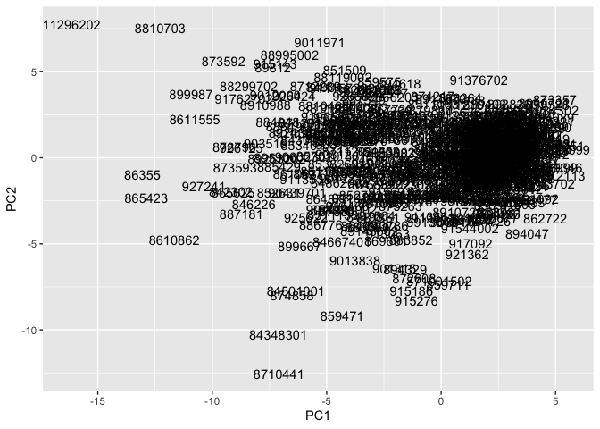
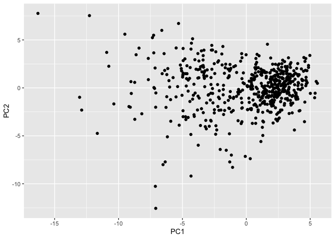
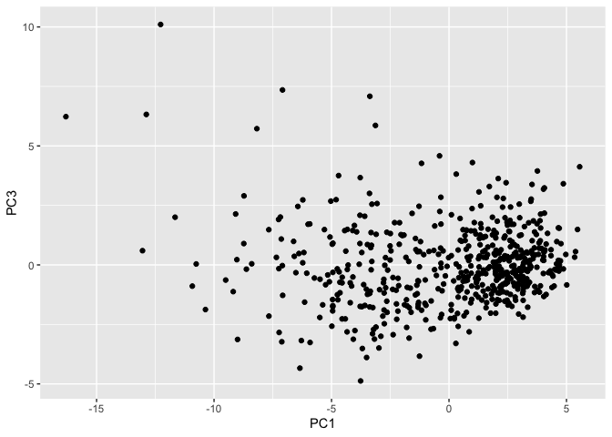
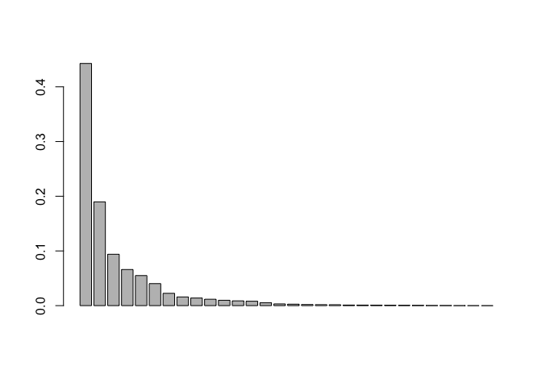

# Class 8 Mini Project
Emily Chase (PID A14656894)

- [Background](#background)
- [Data Import](#data-import)
- [PCA](#pca)
  - [Calculate variance of each
    component](#calculate-variance-of-each-component)
  - [Communicating PCA results](#communicating-pca-results)
- [Hierarchical clustering](#hierarchical-clustering)
  - [Using different methods](#using-different-methods)
- [Combining PCA and Clustering](#combining-pca-and-clustering)

## Background

Extend what you’ve learned by combining PCA as a preprocessing step to
clustering using data that consist of measurements of cell nuclei of
human breast masses.

The data itself comes from the Wisconsin Breast Cancer Diagnostic Data
Set first reported by K. P. Benne and O. L. Mangasarian: “Robust Linear
Programming Discrimination of Two Linearly Inseparable Sets”.

Values in this data set describe characteristics of the cell nuclei
present in digitized images of a fine needle aspiration (FNA) of a
breast mass.

## Data Import

``` r
fna.data <- "WisconsinCancer.csv"

# We'll use the identifiers as names (ie don't leave them in the df) so that it doesn't accidentally become part of our analysis downstream
wisc.df <- read.csv(fna.data, row.names=1) 
colnames(wisc.df)
```

     [1] "diagnosis"               "radius_mean"            
     [3] "texture_mean"            "perimeter_mean"         
     [5] "area_mean"               "smoothness_mean"        
     [7] "compactness_mean"        "concavity_mean"         
     [9] "concave.points_mean"     "symmetry_mean"          
    [11] "fractal_dimension_mean"  "radius_se"              
    [13] "texture_se"              "perimeter_se"           
    [15] "area_se"                 "smoothness_se"          
    [17] "compactness_se"          "concavity_se"           
    [19] "concave.points_se"       "symmetry_se"            
    [21] "fractal_dimension_se"    "radius_worst"           
    [23] "texture_worst"           "perimeter_worst"        
    [25] "area_worst"              "smoothness_worst"       
    [27] "compactness_worst"       "concavity_worst"        
    [29] "concave.points_worst"    "symmetry_worst"         
    [31] "fractal_dimension_worst"

Since our analysis is going to be unsupervised, we are going to take out
the “answers” (the professional diagnosis)

``` r
# We can use -1 here to remove the first column
wisc.data <- wisc.df[,-1]
# save the excluded column
diagnosis <- as.factor(wisc.df$diagnosis)


head(wisc.data[,1:3])
```

             radius_mean texture_mean perimeter_mean
    842302         17.99        10.38         122.80
    842517         20.57        17.77         132.90
    84300903       19.69        21.25         130.00
    84348301       11.42        20.38          77.58
    84358402       20.29        14.34         135.10
    843786         12.45        15.70          82.57

> Q1. How many observations are in this dataset?

``` r
nrow(wisc.df)
```

    [1] 569

There are 569 observations/samples/patients in the data set.

> Q2. How many of the observations have a malignant diagnosis?

``` r
sum(wisc.df$diagnosis == "M")
```

    [1] 212

``` r
table(wisc.df$diagnosis)
```


      B   M 
    357 212 

There are `sum(wisc.df$diagnosis == "M")` malignant diagnoses.

> Q3. How many variables/features in the data are suffixed with \_mean?

``` r
length(grep("_mean",colnames(wisc.df)))
```

    [1] 10

There are `length(grep("_mean",colnames(wisc.df)))` columns that give a
mean summary value.

## PCA

The main function in base R for PCA is called `prcomp()`. It has
arguments x, scale=F, center=T. Center is about whether they should zero
center the data (subtract by the mean to have mean 0). *scale* is about
whether the data should be scaled to have unit variance. PCA will
unfairly be influenced by the columns that have the most variance. Some
columns will have more variance just because you picked a different
unit.

**You almost always want to scale your data.** This means you’ll always
set the argument `scale=TRUE`.

It is important to check if the data need to be scaled before performing
PCA. Recall two common reasons for scaling data include:

- The input variables use different units of measurement.
- The input variables have significantly different variances.

Check the mean and standard deviation of the features (i.e. columns) of
the wisc.data to determine if the data should be scaled. Use the
colMeans() and apply() functions like you’ve done before.

``` r
colMeans(wisc.data)
```

                radius_mean            texture_mean          perimeter_mean 
               1.412729e+01            1.928965e+01            9.196903e+01 
                  area_mean         smoothness_mean        compactness_mean 
               6.548891e+02            9.636028e-02            1.043410e-01 
             concavity_mean     concave.points_mean           symmetry_mean 
               8.879932e-02            4.891915e-02            1.811619e-01 
     fractal_dimension_mean               radius_se              texture_se 
               6.279761e-02            4.051721e-01            1.216853e+00 
               perimeter_se                 area_se           smoothness_se 
               2.866059e+00            4.033708e+01            7.040979e-03 
             compactness_se            concavity_se       concave.points_se 
               2.547814e-02            3.189372e-02            1.179614e-02 
                symmetry_se    fractal_dimension_se            radius_worst 
               2.054230e-02            3.794904e-03            1.626919e+01 
              texture_worst         perimeter_worst              area_worst 
               2.567722e+01            1.072612e+02            8.805831e+02 
           smoothness_worst       compactness_worst         concavity_worst 
               1.323686e-01            2.542650e-01            2.721885e-01 
       concave.points_worst          symmetry_worst fractal_dimension_worst 
               1.146062e-01            2.900756e-01            8.394582e-02 

``` r
apply(wisc.data,2,sd)
```

                radius_mean            texture_mean          perimeter_mean 
               3.524049e+00            4.301036e+00            2.429898e+01 
                  area_mean         smoothness_mean        compactness_mean 
               3.519141e+02            1.406413e-02            5.281276e-02 
             concavity_mean     concave.points_mean           symmetry_mean 
               7.971981e-02            3.880284e-02            2.741428e-02 
     fractal_dimension_mean               radius_se              texture_se 
               7.060363e-03            2.773127e-01            5.516484e-01 
               perimeter_se                 area_se           smoothness_se 
               2.021855e+00            4.549101e+01            3.002518e-03 
             compactness_se            concavity_se       concave.points_se 
               1.790818e-02            3.018606e-02            6.170285e-03 
                symmetry_se    fractal_dimension_se            radius_worst 
               8.266372e-03            2.646071e-03            4.833242e+00 
              texture_worst         perimeter_worst              area_worst 
               6.146258e+00            3.360254e+01            5.693570e+02 
           smoothness_worst       compactness_worst         concavity_worst 
               2.283243e-02            1.573365e-01            2.086243e-01 
       concave.points_worst          symmetry_worst fractal_dimension_worst 
               6.573234e-02            6.186747e-02            1.806127e-02 

``` r
wisc.pr <- prcomp(wisc.data, scale=TRUE)
summary(wisc.pr)
```

    Importance of components:
                              PC1    PC2     PC3     PC4     PC5     PC6     PC7
    Standard deviation     3.6444 2.3857 1.67867 1.40735 1.28403 1.09880 0.82172
    Proportion of Variance 0.4427 0.1897 0.09393 0.06602 0.05496 0.04025 0.02251
    Cumulative Proportion  0.4427 0.6324 0.72636 0.79239 0.84734 0.88759 0.91010
                               PC8    PC9    PC10   PC11    PC12    PC13    PC14
    Standard deviation     0.69037 0.6457 0.59219 0.5421 0.51104 0.49128 0.39624
    Proportion of Variance 0.01589 0.0139 0.01169 0.0098 0.00871 0.00805 0.00523
    Cumulative Proportion  0.92598 0.9399 0.95157 0.9614 0.97007 0.97812 0.98335
                              PC15    PC16    PC17    PC18    PC19    PC20   PC21
    Standard deviation     0.30681 0.28260 0.24372 0.22939 0.22244 0.17652 0.1731
    Proportion of Variance 0.00314 0.00266 0.00198 0.00175 0.00165 0.00104 0.0010
    Cumulative Proportion  0.98649 0.98915 0.99113 0.99288 0.99453 0.99557 0.9966
                              PC22    PC23   PC24    PC25    PC26    PC27    PC28
    Standard deviation     0.16565 0.15602 0.1344 0.12442 0.09043 0.08307 0.03987
    Proportion of Variance 0.00091 0.00081 0.0006 0.00052 0.00027 0.00023 0.00005
    Cumulative Proportion  0.99749 0.99830 0.9989 0.99942 0.99969 0.99992 0.99997
                              PC29    PC30
    Standard deviation     0.02736 0.01153
    Proportion of Variance 0.00002 0.00000
    Cumulative Proportion  1.00000 1.00000

Let’s make our main result figure - the “PC Plot” or “score plot”,
“ordination plot”, etc

``` r
head(wisc.pr$x)
```

                   PC1        PC2        PC3       PC4        PC5         PC6
    842302   -9.184755  -1.946870 -1.1221788 3.6305364  1.1940595  1.41018364
    842517   -2.385703   3.764859 -0.5288274 1.1172808 -0.6212284  0.02863116
    84300903 -5.728855   1.074229 -0.5512625 0.9112808  0.1769302  0.54097615
    84348301 -7.116691 -10.266556 -3.2299475 0.1524129  2.9582754  3.05073750
    84358402 -3.931842   1.946359  1.3885450 2.9380542 -0.5462667 -1.22541641
    843786   -2.378155  -3.946456 -2.9322967 0.9402096  1.0551135 -0.45064213
                     PC7         PC8         PC9       PC10       PC11       PC12
    842302    2.15747152  0.39805698 -0.15698023 -0.8766305 -0.2627243 -0.8582593
    842517    0.01334635 -0.24077660 -0.71127897  1.1060218 -0.8124048  0.1577838
    84300903 -0.66757908 -0.09728813  0.02404449  0.4538760  0.6050715  0.1242777
    84348301  1.42865363 -1.05863376 -1.40420412 -1.1159933  1.1505012  1.0104267
    84358402 -0.93538950 -0.63581661 -0.26357355  0.3773724 -0.6507870 -0.1104183
    843786    0.49001396  0.16529843 -0.13335576 -0.5299649 -0.1096698  0.0813699
                    PC13         PC14         PC15        PC16        PC17
    842302    0.10329677 -0.690196797  0.601264078  0.74446075 -0.26523740
    842517   -0.94269981 -0.652900844 -0.008966977 -0.64823831 -0.01719707
    84300903 -0.41026561  0.016665095 -0.482994760  0.32482472  0.19075064
    84348301 -0.93245070 -0.486988399  0.168699395  0.05132509  0.48220960
    84358402  0.38760691 -0.538706543 -0.310046684 -0.15247165  0.13302526
    843786   -0.02625135  0.003133944 -0.178447576 -0.01270566  0.19671335
                    PC18       PC19        PC20         PC21        PC22
    842302   -0.54907956  0.1336499  0.34526111  0.096430045 -0.06878939
    842517    0.31801756 -0.2473470 -0.11403274 -0.077259494  0.09449530
    84300903 -0.08789759 -0.3922812 -0.20435242  0.310793246  0.06025601
    84348301 -0.03584323 -0.0267241 -0.46432511  0.433811661  0.20308706
    84358402 -0.01869779  0.4610302  0.06543782 -0.116442469  0.01763433
    843786   -0.29727706 -0.1297265 -0.07117453 -0.002400178  0.10108043
                    PC23         PC24         PC25         PC26        PC27
    842302    0.08444429  0.175102213  0.150887294 -0.201326305 -0.25236294
    842517   -0.21752666 -0.011280193  0.170360355 -0.041092627  0.18111081
    84300903 -0.07422581 -0.102671419 -0.171007656  0.004731249  0.04952586
    84348301 -0.12399554 -0.153294780 -0.077427574 -0.274982822  0.18330078
    84358402  0.13933105  0.005327110 -0.003059371  0.039219780  0.03213957
    843786    0.03344819 -0.002837749 -0.122282765 -0.030272333 -0.08438081
                      PC28         PC29          PC30
    842302   -0.0338846387  0.045607590  0.0471277407
    842517    0.0325955021 -0.005682424  0.0018662342
    84300903  0.0469844833  0.003143131 -0.0007498749
    84348301  0.0424469831 -0.069233868  0.0199198881
    84358402 -0.0347556386  0.005033481 -0.0211951203
    843786    0.0007296587 -0.019703996 -0.0034564331

``` r
library(ggplot2)
```

    Warning: package 'ggplot2' was built under R version 4.5.2

``` r
ggplot(wisc.pr$x) +aes(x=PC1, y=PC2, col=diagnosis) + geom_point()
```


``` r
summary(wisc.pr)
```

    Importance of components:
                              PC1    PC2     PC3     PC4     PC5     PC6     PC7
    Standard deviation     3.6444 2.3857 1.67867 1.40735 1.28403 1.09880 0.82172
    Proportion of Variance 0.4427 0.1897 0.09393 0.06602 0.05496 0.04025 0.02251
    Cumulative Proportion  0.4427 0.6324 0.72636 0.79239 0.84734 0.88759 0.91010
                               PC8    PC9    PC10   PC11    PC12    PC13    PC14
    Standard deviation     0.69037 0.6457 0.59219 0.5421 0.51104 0.49128 0.39624
    Proportion of Variance 0.01589 0.0139 0.01169 0.0098 0.00871 0.00805 0.00523
    Cumulative Proportion  0.92598 0.9399 0.95157 0.9614 0.97007 0.97812 0.98335
                              PC15    PC16    PC17    PC18    PC19    PC20   PC21
    Standard deviation     0.30681 0.28260 0.24372 0.22939 0.22244 0.17652 0.1731
    Proportion of Variance 0.00314 0.00266 0.00198 0.00175 0.00165 0.00104 0.0010
    Cumulative Proportion  0.98649 0.98915 0.99113 0.99288 0.99453 0.99557 0.9966
                              PC22    PC23   PC24    PC25    PC26    PC27    PC28
    Standard deviation     0.16565 0.15602 0.1344 0.12442 0.09043 0.08307 0.03987
    Proportion of Variance 0.00091 0.00081 0.0006 0.00052 0.00027 0.00023 0.00005
    Cumulative Proportion  0.99749 0.99830 0.9989 0.99942 0.99969 0.99992 0.99997
                              PC29    PC30
    Standard deviation     0.02736 0.01153
    Proportion of Variance 0.00002 0.00000
    Cumulative Proportion  1.00000 1.00000

> Q4. From your results, what proportion of the original variance is
> captured by the first principal components (PC1)?

44.27% of the original variance is described by PC1.

> Q5. How many principal components (PCs) are required to describe at
> least 70% of the original variance in the data?

According to cumulative proportion of the variance, we see that the
cumulative variance crosses the 70% threshold at PC3, so 3 PCs are
required.

> Q6. How many principal components (PCs) are required to describe at
> least 90% of the original variance in the data?

7 PCs gets us to 91% cumulative variance.

> Q7. What stands out to you about this plot? Is it easy or difficult to
> understand? Why?

``` r
ggplot(wisc.pr$x) + aes(x=PC1, y=PC2) + geom_text(aes(label = rownames(wisc.pr$x)))
```



``` r
ggplot(wisc.pr$x) + aes(x=PC1, y=PC2) + geom_point()
```



Using text makes the overlapping data impossible to parse, but using
points shows the spead a little more clearly. Still can’t see the
groupings well yet though because it’s all in one color.

> Q8. Generate a similar plot for principal components 1 and 3. What do
> you notice about these plots?

``` r
ggplot(wisc.pr$x) + aes(x=PC1, y=PC3) + geom_point()
```



The data looks even messier using PC3 instead of PC2, because PC2
explains more variance than PC3.

``` r
ggplot(wisc.pr$x) + aes(x=PC1, y=PC3, col=diagnosis) + geom_point()
```


### Calculate variance of each component

``` r
pr.var <- wisc.pr$sdev^2
head(pr.var)
```

    [1] 13.281608  5.691355  2.817949  1.980640  1.648731  1.207357

``` r
# Variance explained by each principal component: pve
pve <-  pr.var / sum(pr.var)
pve
```

     [1] 4.427203e-01 1.897118e-01 9.393163e-02 6.602135e-02 5.495768e-02
     [6] 4.024522e-02 2.250734e-02 1.588724e-02 1.389649e-02 1.168978e-02
    [11] 9.797190e-03 8.705379e-03 8.045250e-03 5.233657e-03 3.137832e-03
    [16] 2.662093e-03 1.979968e-03 1.753959e-03 1.649253e-03 1.038647e-03
    [21] 9.990965e-04 9.146468e-04 8.113613e-04 6.018336e-04 5.160424e-04
    [26] 2.725880e-04 2.300155e-04 5.297793e-05 2.496010e-05 4.434827e-06

``` r
# Plot variance explained for each principal component
plot(pve, xlab = "Principal Component", 
     ylab = "Proportion of Variance Explained", 
     ylim = c(0, 1), type = "o")
```


``` r
barplot(pve)
```



### Communicating PCA results

> Q9. For the first principal component, what is the component of the
> loading vector (i.e. wisc.pr\$rotation\[,1\]) for the feature
> concave.points_mean? This tells us how much this original feature
> contributes to the first PC.

``` r
head(wisc.pr$rotation[,1:3], 10)
```

                                   PC1         PC2          PC3
    radius_mean            -0.21890244  0.23385713 -0.008531243
    texture_mean           -0.10372458  0.05970609  0.064549903
    perimeter_mean         -0.22753729  0.21518136 -0.009314220
    area_mean              -0.22099499  0.23107671  0.028699526
    smoothness_mean        -0.14258969 -0.18611302 -0.104291904
    compactness_mean       -0.23928535 -0.15189161 -0.074091571
    concavity_mean         -0.25840048 -0.06016536  0.002733838
    concave.points_mean    -0.26085376  0.03476750 -0.025563541
    symmetry_mean          -0.13816696 -0.19034877 -0.040239936
    fractal_dimension_mean -0.06436335 -0.36657547 -0.022574090

The loading for concave.points_mean is -0.26085376.

## Hierarchical clustering

> Q10. Using the plot() and abline() functions, what is the height at
> which the clustering model has 4 clusters?

``` r
# Scale the wisc.data data using the "scale()" function
data.scaled <- scale(wisc.data)
data.dist <- dist(data.scaled)
wisc.hclust <- hclust(data.dist, method="complete")

plot(wisc.hclust)
abline(h=18, col="red", lty=2)
```


``` r
wisc.hclust.clusters <- cutree(wisc.hclust, h=19)
table(wisc.hclust.clusters, diagnosis)
```

                        diagnosis
    wisc.hclust.clusters   B   M
                       1  12 165
                       2   2   5
                       3 343  40
                       4   0   2

### Using different methods

> Q12. Which method gives your favorite results for the same data.dist
> dataset? Explain your reasoning.

``` r
data.scaled <- scale(wisc.data)
data.dist <- dist(data.scaled)

wisc.hclust1 <- hclust(data.dist, method="complete")
plot(wisc.hclust1)
```


``` r
wisc.hclust2 <- hclust(data.dist, method="single") #weird and curvy
plot(wisc.hclust2)
```


``` r
wisc.hclust3 <- hclust(data.dist, method="average") # shows three distinctish groups
plot(wisc.hclust3)
```


``` r
wisc.hclust4 <- hclust(data.dist, method="ward.D2") # this is the clearest 
plot(wisc.hclust4)
```


I like `ward.D2` the best. It shows the clearest differences between
groups.

## Combining PCA and Clustering

Use knowledge from our PCA (eg our scree plots!) and using it to inform
our dendrogram

``` r
d <- dist(wisc.pr$x[,1:3]) # we know from our scree plot that we should just choose the first 3 PCs
wisc.pr.hclust <- hclust(d, method="ward.D2")
plot(wisc.pr.hclust)
abline(h=70, col="red")
```


Get my cluster membership

``` r
grps <- cutree(wisc.pr.hclust, h=70)
table(grps)
```

    grps
      1   2 
    203 366 

``` r
table(diagnosis)
```

    diagnosis
      B   M 
    357 212 

> Q13. How well does the newly created model with four clusters separate
> out the two diagnoses?

Is my clustering capturing this B vs M? Let’s compare our clusters
(`grps`) in `diagnosis`. Make a wee “cross-table”.

``` r
table(grps,diagnosis)
```

        diagnosis
    grps   B   M
       1  24 179
       2 333  33

True Positive = 179 False Positive = 24

True Negative = 333 False Negative = 33

> Q14. How well do the hierarchical clustering models you created in
> previous sections (i.e. before PCA) do in terms of separating the
> diagnoses? Again, use the table() function to compare the output of
> each model (wisc.km\$cluster and wisc.hclust.clusters) with the vector
> containing the actual diagnoses.

``` r
table(wisc.hclust.clusters, diagnosis)
```

                        diagnosis
    wisc.hclust.clusters   B   M
                       1  12 165
                       2   2   5
                       3 343  40
                       4   0   2

This comparison is a little trickier because it has four categories vs
the binary diagnosis. But based on where the majority of the values lie,
there are fewer false positives but more false negatives. I personally
think false negatives are even scarier than false positives (false
positives can mean further testing but false negatives can mean that no
further investigation will happen)
