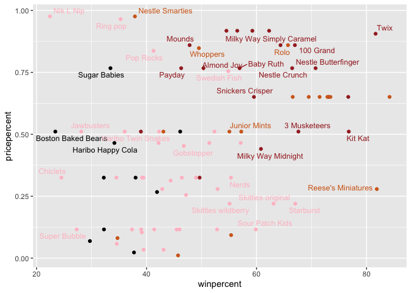
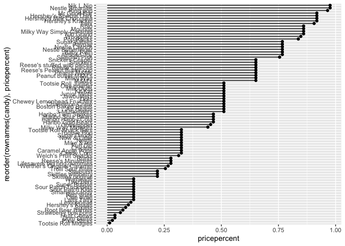
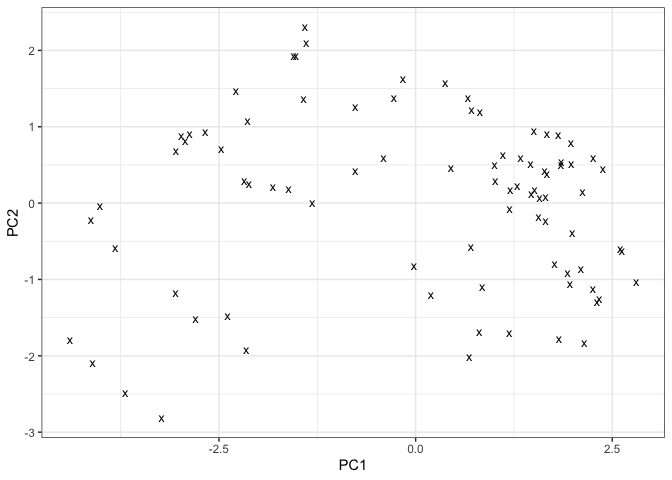
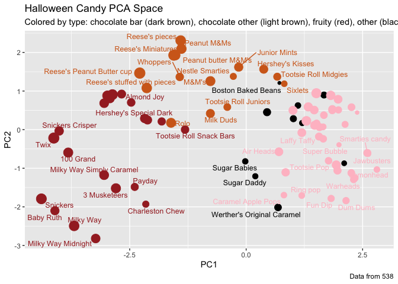

# Halloween (Class 10) Mini Project
Emily Chase (PID A14656894)

- [Import candy data](#import-candy-data)
- [Stats on our favorite candies](#stats-on-our-favorite-candies)
  - [skimr](#skimr)
- [Overall candy rankings](#overall-candy-rankings)
  - [Adding color](#adding-color)
- [Pricepoint](#pricepoint)
- [Correlation](#correlation)
- [PCA](#pca)

## Import candy data

``` r
candy_file <- "candy-data.csv"

candy = read.csv(candy_file, row.names=1)
head(candy)
```

                 chocolate fruity caramel peanutyalmondy nougat crispedricewafer
    100 Grand            1      0       1              0      0                1
    3 Musketeers         1      0       0              0      1                0
    One dime             0      0       0              0      0                0
    One quarter          0      0       0              0      0                0
    Air Heads            0      1       0              0      0                0
    Almond Joy           1      0       0              1      0                0
                 hard bar pluribus sugarpercent pricepercent winpercent
    100 Grand       0   1        0        0.732        0.860   66.97173
    3 Musketeers    0   1        0        0.604        0.511   67.60294
    One dime        0   0        0        0.011        0.116   32.26109
    One quarter     0   0        0        0.011        0.511   46.11650
    Air Heads       0   0        0        0.906        0.511   52.34146
    Almond Joy      0   1        0        0.465        0.767   50.34755

> Q1. How many different candy types are in this dataset?

``` r
nrow(candy)
```

    [1] 85

There are 85 different candy types

> Q2. How many fruity candy types are in the dataset?

``` r
sum(candy$fruity)
```

    [1] 38

38 candy types are fruity

## Stats on our favorite candies

> Q3. What is your favorite candy in the dataset and what is it’s
> winpercent value?

``` r
candy["Kit Kat",]$winpercent
```

    [1] 76.7686

My favorite candy is Kit Kat and its winpercent is
`rcandy["Kit Kat",]$winpercent`%.

> Q4. What is the winpercent value for “Kit Kat”?

As stated above Kit Kat’s winpercent is
`rcandy["Kit Kat",]$winpercent`%.

> Q5. What is the winpercent value for “Tootsie Roll Snack Bars”?

Tootsie Rolls Snack Bars winpercent is
`rcandy["Tootsie Rolls Snack Bars",]$winpercent`%.

### skimr

``` r
# install.packages("skimr")
library(skimr)
skim(candy)
```

|                                                  |       |
|:-------------------------------------------------|:------|
| Name                                             | candy |
| Number of rows                                   | 85    |
| Number of columns                                | 12    |
| \_\_\_\_\_\_\_\_\_\_\_\_\_\_\_\_\_\_\_\_\_\_\_   |       |
| Column type frequency:                           |       |
| numeric                                          | 12    |
| \_\_\_\_\_\_\_\_\_\_\_\_\_\_\_\_\_\_\_\_\_\_\_\_ |       |
| Group variables                                  | None  |

Data summary

**Variable type: numeric**

| skim_variable | n_missing | complete_rate | mean | sd | p0 | p25 | p50 | p75 | p100 | hist |
|:---|---:|---:|---:|---:|---:|---:|---:|---:|---:|:---|
| chocolate | 0 | 1 | 0.44 | 0.50 | 0.00 | 0.00 | 0.00 | 1.00 | 1.00 | ▇▁▁▁▆ |
| fruity | 0 | 1 | 0.45 | 0.50 | 0.00 | 0.00 | 0.00 | 1.00 | 1.00 | ▇▁▁▁▆ |
| caramel | 0 | 1 | 0.16 | 0.37 | 0.00 | 0.00 | 0.00 | 0.00 | 1.00 | ▇▁▁▁▂ |
| peanutyalmondy | 0 | 1 | 0.16 | 0.37 | 0.00 | 0.00 | 0.00 | 0.00 | 1.00 | ▇▁▁▁▂ |
| nougat | 0 | 1 | 0.08 | 0.28 | 0.00 | 0.00 | 0.00 | 0.00 | 1.00 | ▇▁▁▁▁ |
| crispedricewafer | 0 | 1 | 0.08 | 0.28 | 0.00 | 0.00 | 0.00 | 0.00 | 1.00 | ▇▁▁▁▁ |
| hard | 0 | 1 | 0.18 | 0.38 | 0.00 | 0.00 | 0.00 | 0.00 | 1.00 | ▇▁▁▁▂ |
| bar | 0 | 1 | 0.25 | 0.43 | 0.00 | 0.00 | 0.00 | 0.00 | 1.00 | ▇▁▁▁▂ |
| pluribus | 0 | 1 | 0.52 | 0.50 | 0.00 | 0.00 | 1.00 | 1.00 | 1.00 | ▇▁▁▁▇ |
| sugarpercent | 0 | 1 | 0.48 | 0.28 | 0.01 | 0.22 | 0.47 | 0.73 | 0.99 | ▇▇▇▇▆ |
| pricepercent | 0 | 1 | 0.47 | 0.29 | 0.01 | 0.26 | 0.47 | 0.65 | 0.98 | ▇▇▇▇▆ |
| winpercent | 0 | 1 | 50.32 | 14.71 | 22.45 | 39.14 | 47.83 | 59.86 | 84.18 | ▃▇▆▅▂ |

> Q6. Is there any variable/column that looks to be on a different scale
> to the majority of the other columns in the dataset?

The win percent is on a different scale than the other columns. I can
tell by looking at the mean and percentiles – the values for winpercent
are \>\>1 and the other columns are between 1 and 0.

> Q7. What do you think a zero and one represent for the
> candy\$chocolate column?

The 0 is False and 1 is True for the categorie columns including
chocolate. If a candy is/contains chocolate, it gets a 1 in the column,
otherwise it gets a 0.

> Q8. Plot a histogram of winpercent values

``` r
hist(candy$winpercent)
```


> Q9. Is the distribution of winpercent values symmetrical?

No it is skewed to the left with a long tail to the right. In other
words, though the range is 20 to 90, the peak of the curve is around 45,
which is not the center of the distribution.

> Q10. Is the center of the distribution above or below 50%?

``` r
# library(DescTools)
median(candy$winpercent)
```

    [1] 47.82975

``` r
# Mode(candy$winpercent) -- didn't work, used for categorical data !

dens <- density(candy$winpercent)
# mode
dens$x[which.max(dens$y)]
```

    [1] 42.50432

I think the question is about the 50% mark on the x axis, in which case
the center of the distribution (which I interpret as the median) is
below that. If we consider the mode to be the center of the
distribution, it is also below the 50%.

> Q11. On average is chocolate candy higher or lower ranked than fruit
> candy?

``` r
choc_mean_win <- mean(candy$winpercent[as.logical(candy$chocolate)])
fruity_mean_win <-mean(candy$winpercent[as.logical(candy$fruity)])

choc_mean_win > fruity_mean_win
```

    [1] TRUE

Chocolate candy is higher ranked than fruit candy.

> Q12. Is this difference statistically significant?

``` r
t.test(winpercent ~ fruity, data = candy)
```


        Welch Two Sample t-test

    data:  winpercent by fruity
    t = 3.9232, df = 79.384, p-value = 0.0001847
    alternative hypothesis: true difference in means between group 0 and group 1 is not equal to 0
    95 percent confidence interval:
      5.521665 16.893097
    sample estimates:
    mean in group 0 mean in group 1 
           55.32712        44.11974 

We can reject the null hypothesis (that there is no difference in means
for chocolate vs fruity) because the p value is \<\<5%

## Overall candy rankings

> Q13. What are the five least liked candy types in this set?

``` r
library(dplyr)
```


    Attaching package: 'dplyr'

    The following objects are masked from 'package:stats':

        filter, lag

    The following objects are masked from 'package:base':

        intersect, setdiff, setequal, union

``` r
candy %>% arrange(winpercent) %>% head(5)
```

                       chocolate fruity caramel peanutyalmondy nougat
    Nik L Nip                  0      1       0              0      0
    Boston Baked Beans         0      0       0              1      0
    Chiclets                   0      1       0              0      0
    Super Bubble               0      1       0              0      0
    Jawbusters                 0      1       0              0      0
                       crispedricewafer hard bar pluribus sugarpercent pricepercent
    Nik L Nip                         0    0   0        1        0.197        0.976
    Boston Baked Beans                0    0   0        1        0.313        0.511
    Chiclets                          0    0   0        1        0.046        0.325
    Super Bubble                      0    0   0        0        0.162        0.116
    Jawbusters                        0    1   0        1        0.093        0.511
                       winpercent
    Nik L Nip            22.44534
    Boston Baked Beans   23.41782
    Chiclets             24.52499
    Super Bubble         27.30386
    Jawbusters           28.12744

The five least liked candies are Nik L Nip, Boston Baked Beans,
Chiclets, Super Bubble, and Jawbusters.

> Q14. What are the top 5 all time favorite candy types out of this set?

``` r
candy %>% arrange(desc(winpercent)) %>% head(5)
```

                              chocolate fruity caramel peanutyalmondy nougat
    Reese's Peanut Butter cup         1      0       0              1      0
    Reese's Miniatures                1      0       0              1      0
    Twix                              1      0       1              0      0
    Kit Kat                           1      0       0              0      0
    Snickers                          1      0       1              1      1
                              crispedricewafer hard bar pluribus sugarpercent
    Reese's Peanut Butter cup                0    0   0        0        0.720
    Reese's Miniatures                       0    0   0        0        0.034
    Twix                                     1    0   1        0        0.546
    Kit Kat                                  1    0   1        0        0.313
    Snickers                                 0    0   1        0        0.546
                              pricepercent winpercent
    Reese's Peanut Butter cup        0.651   84.18029
    Reese's Miniatures               0.279   81.86626
    Twix                             0.906   81.64291
    Kit Kat                          0.511   76.76860
    Snickers                         0.651   76.67378

The top five most liked candies are Reese’s PB cups, Reese’s minis,
Twix, Kit Kat, and Snickers.

I like using dplyr because the piping is intuitive for me for both
reading and writing, since the logic flow is left to right rather than
inside out.

> Q15. Make a first barplot of candy ranking based on winpercent values.

``` r
library(ggplot2)
```

    Warning: package 'ggplot2' was built under R version 4.5.2

``` r
ggplot(candy) + aes(winpercent, rownames(candy)) + geom_col()
```


> This is quite ugly, use the reorder() function to get the bars sorted
> by winpercent?

``` r
ggplot(candy) + aes(winpercent, reorder(rownames(candy), winpercent)) + geom_col()  
```


### Adding color

``` r
my_cols=rep("black", nrow(candy))
my_cols[as.logical(candy$chocolate)] = "chocolate"
my_cols[as.logical(candy$bar)] = "brown"
my_cols[as.logical(candy$fruity)] = "pink"
```

``` r
ggplot(candy) + aes(winpercent, reorder(rownames(candy), winpercent)) +
  # geom_col(col=my_cols) # the inside (fill) is gray while the border is colored
  geom_col(fill=my_cols)
```


## Pricepoint

``` r
library(ggrepel)

ggplot(candy) +
  aes(winpercent, pricepercent, label=rownames(candy)) +
  geom_point(col=my_cols) + 
  geom_text_repel(col=my_cols, size=3.3, max.overlaps = 5)
```

    Warning: ggrepel: 50 unlabeled data points (too many overlaps). Consider
    increasing max.overlaps



> Q19. Which candy type is the highest ranked in terms of winpercent for
> the least money - i.e. offers the most bang for your buck?

We can see on the graph: Reeses mini’s is the bottom corner-most value
(highest winpercent for lowest pricepercent).

> Q20. What are the top 5 most expensive candy types in the dataset and
> of these which is the least popular?

``` r
candy %>% arrange(desc(pricepercent)) %>% head(5)
```

                             chocolate fruity caramel peanutyalmondy nougat
    Nik L Nip                        0      1       0              0      0
    Nestle Smarties                  1      0       0              0      0
    Ring pop                         0      1       0              0      0
    Hershey's Krackel                1      0       0              0      0
    Hershey's Milk Chocolate         1      0       0              0      0
                             crispedricewafer hard bar pluribus sugarpercent
    Nik L Nip                               0    0   0        1        0.197
    Nestle Smarties                         0    0   0        1        0.267
    Ring pop                                0    1   0        0        0.732
    Hershey's Krackel                       1    0   1        0        0.430
    Hershey's Milk Chocolate                0    0   1        0        0.430
                             pricepercent winpercent
    Nik L Nip                       0.976   22.44534
    Nestle Smarties                 0.976   37.88719
    Ring pop                        0.965   35.29076
    Hershey's Krackel               0.918   62.28448
    Hershey's Milk Chocolate        0.918   56.49050

The 5 most expensive candies are Nik L Nip, Ring Pop, Nestle Smarties,
Hershey’s Krackel, and Hershey’s Milk Chocolate. The least popular of
these is clear on the graph: Nik L Nip.

> Q21. Make a barplot again with geom_col() this time using pricepercent
> and then improve this step by step, first ordering the x-axis by value
> and finally making a so called “dot chat” or “lollipop” chart by
> swapping geom_col() for geom_point() + geom_segment().

``` r
ggplot(candy) + 
  aes(pricepercent, reorder(rownames(candy), pricepercent)) + 
  geom_point() + 
  geom_segment(aes(yend=reorder(rownames(candy), pricepercent), xend=0))
```



## Correlation

``` r
# install.packages("corrplot")
library(corrplot)
```

    corrplot 0.95 loaded

``` r
cij <- cor(candy)
corrplot(cij)
```


> Q22. Examining this plot what two variables are anti-correlated
> (i.e. have minus values)?

Chocolate/fruity and pluribus/bar are anticorrelated.

> Q23. Similarly, what two variables are most positively correlated?

It appears that chocolate and winpercent are the most positively
correlated.

## PCA

``` r
pca <- prcomp(candy, scale=TRUE)
summary(pca)
```

    Importance of components:
                              PC1    PC2    PC3     PC4    PC5     PC6     PC7
    Standard deviation     2.0788 1.1378 1.1092 1.07533 0.9518 0.81923 0.81530
    Proportion of Variance 0.3601 0.1079 0.1025 0.09636 0.0755 0.05593 0.05539
    Cumulative Proportion  0.3601 0.4680 0.5705 0.66688 0.7424 0.79830 0.85369
                               PC8     PC9    PC10    PC11    PC12
    Standard deviation     0.74530 0.67824 0.62349 0.43974 0.39760
    Proportion of Variance 0.04629 0.03833 0.03239 0.01611 0.01317
    Cumulative Proportion  0.89998 0.93832 0.97071 0.98683 1.00000

``` r
pca$rotation[,1]
```

           chocolate           fruity          caramel   peanutyalmondy 
          -0.4019466        0.3683883       -0.2299709       -0.2407155 
              nougat crispedricewafer             hard              bar 
          -0.2268102       -0.2215182        0.2111587       -0.3947433 
            pluribus     sugarpercent     pricepercent       winpercent 
           0.2600041       -0.1083088       -0.3207361       -0.3298035 

``` r
ggplot(pca$x) +
  aes(x = PC1, y = PC2) +
  geom_point(size = 3, shape="x") +
  xlab("PC1") +
  ylab("PC2") +
  theme_bw()
```



``` r
plot(pca$x[,1:2])
```


``` r
plot(pca$x[,1:2], col=my_cols, pch=16)
```


``` r
# Make a new data-frame with our PCA results and candy data
my_data <- cbind(candy, pca$x[,1:3])

p <- ggplot(my_data) + 
        aes(x=PC1, y=PC2, 
            size=winpercent/100,  
            text=rownames(my_data),
            label=rownames(my_data)) +
        geom_point(col=my_cols)

p
```


``` r
p + geom_text_repel(size=3.3, col=my_cols, max.overlaps = 7)  + 
  theme(legend.position = "none") +
  labs(title="Halloween Candy PCA Space",
       subtitle="Colored by type: chocolate bar (dark brown), chocolate other (light brown), fruity (red), other (black)",
       caption="Data from 538")
```

    Warning: ggrepel: 39 unlabeled data points (too many overlaps). Consider
    increasing max.overlaps



``` r
par(mar=c(8,4,2,2))
barplot(pca$rotation[,1], las=2, ylab="PC1 Contribution")
```


> Q24. What original variables are picked up strongly by PC1 in the
> positive direction? Do these make sense to you?

fruity and pluribus – makes sense because i think people like those the
least.

Also, overall, the fruity vs chocolate and bar vs pluribus are the most
strongly picked up signals, which matches the correlation data
observation.
