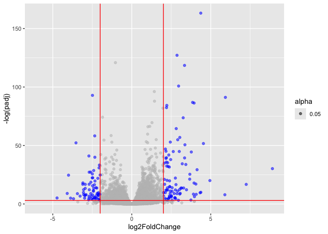

# Class 12: RNAseq
Emily Chase (PID: A14656894)

- [Background](#background)
- [DESeq2](#deseq2)
- [Data Import](#data-import)
- [Toy analysis](#toy-analysis)
- [DESeq analysis](#deseq-analysis)
- [Volcano Plot](#volcano-plot)
- [Save our results](#save-our-results)
- [Add annotation data](#add-annotation-data)
- [Save my annotated results](#save-my-annotated-results)
- [Pathway analysis](#pathway-analysis)

## Background

Today we will analyze some RNASeq data from Himes et al. on the effects
of a common steroid (dexamethasone (“dex”)) on airway smooth muscle
cells (ASMs).

For this analysis we need two main inputs

- `countData`: a table of **counts** for genes (in rows) across
  conditions/experiments (in columns)
- `colData`: a table of **metadata** about the design of the
  experiments. The rows match the columns in `countData`

## DESeq2

``` r
# BiocManager::install("DESeq2")
library(DESeq2)
```

    Warning: package 'DESeq2' was built under R version 4.5.2

## Data Import

``` r
counts <- read.csv("airway_scaledcounts.csv", row.names=1)
metadata <-  read.csv("airway_metadata.csv")
```

Let’s have a wee peak at our `counts` data

``` r
head(counts) # nt: second row is all 0s so we would typically filter that out
```

                    SRR1039508 SRR1039509 SRR1039512 SRR1039513 SRR1039516
    ENSG00000000003        723        486        904        445       1170
    ENSG00000000005          0          0          0          0          0
    ENSG00000000419        467        523        616        371        582
    ENSG00000000457        347        258        364        237        318
    ENSG00000000460         96         81         73         66        118
    ENSG00000000938          0          0          1          0          2
                    SRR1039517 SRR1039520 SRR1039521
    ENSG00000000003       1097        806        604
    ENSG00000000005          0          0          0
    ENSG00000000419        781        417        509
    ENSG00000000457        447        330        324
    ENSG00000000460         94        102         74
    ENSG00000000938          0          0          0

``` r
head(metadata)
```

              id     dex celltype     geo_id
    1 SRR1039508 control   N61311 GSM1275862
    2 SRR1039509 treated   N61311 GSM1275863
    3 SRR1039512 control  N052611 GSM1275866
    4 SRR1039513 treated  N052611 GSM1275867
    5 SRR1039516 control  N080611 GSM1275870
    6 SRR1039517 treated  N080611 GSM1275871

> Q1. How many “genes” are in this dataset?

``` r
nrow(counts)
```

    [1] 38694

> Q. How many experiments are there?

``` r
# can use columns in counts OR rows in metadata
nrow(metadata)
```

    [1] 8

> Q2. How many “control” experiments are there?

``` r
sum(metadata$dex == "control")
```

    [1] 4

## Toy analysis

1.  Extract the “control” columns from `counts`
2.  Calculate the mean value for each gene in these control columns 3-4.
    Do the same for the “treated” columns
3.  Compare these mean values for each gene

- Take advantage of how each row is a different gene

Step 1.

``` r
metadata$dex == "control" ## use this logical to get out the columns of counts that are controls (subset the control sections of table)
```

    [1]  TRUE FALSE  TRUE FALSE  TRUE FALSE  TRUE FALSE

``` r
control.inds <- metadata$dex == "control"
control.counts <- counts[, control.inds]
```

``` r
head(control.counts)
```

                    SRR1039508 SRR1039512 SRR1039516 SRR1039520
    ENSG00000000003        723        904       1170        806
    ENSG00000000005          0          0          0          0
    ENSG00000000419        467        616        582        417
    ENSG00000000457        347        364        318        330
    ENSG00000000460         96         73        118        102
    ENSG00000000938          0          1          2          0

Step 2.

``` r
control.means <- rowMeans(control.counts)
```

Step 3.

``` r
treated.inds <- metadata$dex != "control"
treated.counts <- counts[,treated.inds]
head(treated.counts)
```

                    SRR1039509 SRR1039513 SRR1039517 SRR1039521
    ENSG00000000003        486        445       1097        604
    ENSG00000000005          0          0          0          0
    ENSG00000000419        523        371        781        509
    ENSG00000000457        258        237        447        324
    ENSG00000000460         81         66         94         74
    ENSG00000000938          0          0          0          0

Step 4.

``` r
treated.means <- rowMeans(treated.counts)
```

For ease of book-keeping we can store these together in one dataframe
called `meancounts`

``` r
meancounts <- data.frame(control.means, treated.means)
head(meancounts)
```

                    control.means treated.means
    ENSG00000000003        900.75        658.00
    ENSG00000000005          0.00          0.00
    ENSG00000000419        520.50        546.00
    ENSG00000000457        339.75        316.50
    ENSG00000000460         97.25         78.75
    ENSG00000000938          0.75          0.00

Let’s plot them against each other

``` r
plot(meancounts, log="xy")
```

    Warning in xy.coords(x, y, xlabel, ylabel, log): 15032 x values <= 0 omitted
    from logarithmic plot

    Warning in xy.coords(x, y, xlabel, ylabel, log): 15281 y values <= 0 omitted
    from logarithmic plot


We use “fold-change” as a way to compare

``` r
# treated/control
log2(10/10) # 0 fold change == no change
```

    [1] 0

``` r
log2(20/10) # log2 fold change of 1
```

    [1] 1

``` r
log2(10/20) # log2 fold change of -1
```

    [1] -1

Let’s add fold change as a column

``` r
meancounts$log2fc <- log2(meancounts$control.means/meancounts$treated.means)
head(meancounts)
```

                    control.means treated.means      log2fc
    ENSG00000000003        900.75        658.00  0.45303916
    ENSG00000000005          0.00          0.00         NaN
    ENSG00000000419        520.50        546.00 -0.06900279
    ENSG00000000457        339.75        316.50  0.10226805
    ENSG00000000460         97.25         78.75  0.30441833
    ENSG00000000938          0.75          0.00         Inf

A common “rule of thumb” for saying some thing is up/down regulated is a
log-fold change \>= 2 (or \<=-2).

We can use pseudocounts or remove the problematic (low count) data.

``` r
# approach 1
# nonzero.ids <- rowSums(meancounts) != 0
# mycounts <- meancounts[nonzero.ids,]

# approach 2
zero.inds <- which(meancounts[,1:2]==0, arr.ind=T)[,1]
mygenes <- meancounts[-zero.inds,]
```

> Q. How many genes are up-regulated at the +2 log2fc threshold?

``` r
sum(mygenes$log2fc >= 2, na.rm=T)
```

    [1] 485

> Q. How many genes are down-regulated at the -2 log2fc threshold?

``` r
sum(mygenes$log2fc <= -2, na.rm=T)
```

    [1] 314

We’re unsatisfied because we don’t know about significance, and we’ve
aggregated data in a haphazard way.

## DESeq analysis

Let’s do this with DESeq2 and put some stats behind these numbers:

``` r
# library(DESeq2) # if you haven't already run it
```

DESeq wants 3 things for analysis:

- countData
- colData
- design

``` r
dds <- DESeqDataSetFromMatrix(countData = counts, 
                       colData = metadata, 
                       design = ~dex)
```

    converting counts to integer mode

    Warning in DESeqDataSet(se, design = design, ignoreRank): some variables in
    design formula are characters, converting to factors

The main function in the DESeq package to run analysis is called
`DESeq()`

``` r
dds <- DESeq(dds)
```

    estimating size factors

    estimating dispersions

    gene-wise dispersion estimates

    mean-dispersion relationship

    final dispersion estimates

    fitting model and testing

Get the results out of this DESeq object with the function `results()`

``` r
res <- results(dds)
head(res)
```

    log2 fold change (MLE): dex treated vs control 
    Wald test p-value: dex treated vs control 
    DataFrame with 6 rows and 6 columns
                      baseMean log2FoldChange     lfcSE      stat    pvalue
                     <numeric>      <numeric> <numeric> <numeric> <numeric>
    ENSG00000000003 747.194195      -0.350703  0.168242 -2.084514 0.0371134
    ENSG00000000005   0.000000             NA        NA        NA        NA
    ENSG00000000419 520.134160       0.206107  0.101042  2.039828 0.0413675
    ENSG00000000457 322.664844       0.024527  0.145134  0.168996 0.8658000
    ENSG00000000460  87.682625      -0.147143  0.256995 -0.572550 0.5669497
    ENSG00000000938   0.319167      -1.732289  3.493601 -0.495846 0.6200029
                         padj
                    <numeric>
    ENSG00000000003  0.163017
    ENSG00000000005        NA
    ENSG00000000419  0.175937
    ENSG00000000457  0.961682
    ENSG00000000460  0.815805
    ENSG00000000938        NA

We’ll use the adjusted p value because it accounts for the sample size
(we don’t want 5% error because that’s a LOT of error)

## Volcano Plot

Puts log fold change on the x axis and adjusted (adj) p value on the y
axis

``` r
plot(res$log2FoldChange, -log(res$padj))
abline(v=c(-2, 2), col="red")
abline(h = -log(0.05), col="red")
```


Upper left and upper right boxes are down and up regulated genes
(respectively).

> Color the genes that we are interested in:

``` r
library(ggplot2)
```

    Warning: package 'ggplot2' was built under R version 4.5.2

``` r
mycols <- rep("gray", nrow(res))
mycols[abs(res$log2FoldChange) >= 2 & res$padj<0.05] <- "blue"

ggplot(res) + aes(x=log2FoldChange, y=-log(padj), alpha = 0.05) + geom_point(col=mycols) + geom_vline(xintercept=c(-2, 2), col="red") + geom_hline(yintercept=-log(0.05), col="red")
```

    Warning: Removed 23549 rows containing missing values or values outside the scale range
    (`geom_point()`).



## Save our results

``` r
write.csv(res, file="myresults.csv")
```

## Add annotation data

We need to add gene symbols, gene names and other database ids to make
my results useful for further analysis.

``` r
head(res) # ENSG000000003 is an ENSEMBL identifier
```

    log2 fold change (MLE): dex treated vs control 
    Wald test p-value: dex treated vs control 
    DataFrame with 6 rows and 6 columns
                      baseMean log2FoldChange     lfcSE      stat    pvalue
                     <numeric>      <numeric> <numeric> <numeric> <numeric>
    ENSG00000000003 747.194195      -0.350703  0.168242 -2.084514 0.0371134
    ENSG00000000005   0.000000             NA        NA        NA        NA
    ENSG00000000419 520.134160       0.206107  0.101042  2.039828 0.0413675
    ENSG00000000457 322.664844       0.024527  0.145134  0.168996 0.8658000
    ENSG00000000460  87.682625      -0.147143  0.256995 -0.572550 0.5669497
    ENSG00000000938   0.319167      -1.732289  3.493601 -0.495846 0.6200029
                         padj
                    <numeric>
    ENSG00000000003  0.163017
    ENSG00000000005        NA
    ENSG00000000419  0.175937
    ENSG00000000457  0.961682
    ENSG00000000460  0.815805
    ENSG00000000938        NA

We have ENSEMBLE database ids in our `res` object

``` r
head(rownames(res))
```

    [1] "ENSG00000000003" "ENSG00000000005" "ENSG00000000419" "ENSG00000000457"
    [5] "ENSG00000000460" "ENSG00000000938"

------------------------------------------------------------------------

November 12 2025

Re-ran all cells prior to starting here:

We can use the `mapIds` function from bioconductor to help us translate
these into entrez IDs.

``` r
# BiocManager::install("AnnotationDbi")
# BiocManager::install("org.Hs.eg.db")

library("AnnotationDbi")
library("org.Hs.eg.db")
```

Let’s see what database id formats we can translate between

``` r
columns(org.Hs.eg.db)
```

     [1] "ACCNUM"       "ALIAS"        "ENSEMBL"      "ENSEMBLPROT"  "ENSEMBLTRANS"
     [6] "ENTREZID"     "ENZYME"       "EVIDENCE"     "EVIDENCEALL"  "GENENAME"    
    [11] "GENETYPE"     "GO"           "GOALL"        "IPI"          "MAP"         
    [16] "OMIM"         "ONTOLOGY"     "ONTOLOGYALL"  "PATH"         "PFAM"        
    [21] "PMID"         "PROSITE"      "REFSEQ"       "SYMBOL"       "UCSCKG"      
    [26] "UNIPROT"     

We can use the mapIds function:

``` r
# mapIds(x=, keys=, column= , keytype=) # these are the required arguments

res$symbol <- mapIds(org.Hs.eg.db, # x is the dataset
                     keys=row.names(res), # what we currently have (Our genenames)
                     keytype="ENSEMBL",        # The format of our genenames
                     column="SYMBOL",          # What we want to translate to / The new format we want to add
                     multiVals="first") # uses first by default
```

    'select()' returned 1:many mapping between keys and columns

``` r
head(res$symbol)
```

    ENSG00000000003 ENSG00000000005 ENSG00000000419 ENSG00000000457 ENSG00000000460 
           "TSPAN6"          "TNMD"          "DPM1"         "SCYL3"         "FIRRM" 
    ENSG00000000938 
              "FGR" 

add `GENENAME`

``` r
res$genename <- mapIds(org.Hs.eg.db, 
                     keys=row.names(res), 
                     keytype="ENSEMBL",        
                     column="GENENAME",         
                     multiVals="first") 
```

    'select()' returned 1:many mapping between keys and columns

``` r
head(res$genename)
```

                                                  ENSG00000000003 
                                                  "tetraspanin 6" 
                                                  ENSG00000000005 
                                                    "tenomodulin" 
                                                  ENSG00000000419 
    "dolichyl-phosphate mannosyltransferase subunit 1, catalytic" 
                                                  ENSG00000000457 
                                       "SCY1 like pseudokinase 3" 
                                                  ENSG00000000460 
      "FIGNL1 interacting regulator of recombination and mitosis" 
                                                  ENSG00000000938 
                 "FGR proto-oncogene, Src family tyrosine kinase" 

add `ENTREZID`

``` r
res$entrezid <- mapIds(org.Hs.eg.db, 
                     keys=row.names(res), 
                     keytype="ENSEMBL",        
                     column="ENTREZID",         
                     multiVals="first") 
```

    'select()' returned 1:many mapping between keys and columns

``` r
head(res$entrezid)
```

    ENSG00000000003 ENSG00000000005 ENSG00000000419 ENSG00000000457 ENSG00000000460 
             "7105"         "64102"          "8813"         "57147"         "55732" 
    ENSG00000000938 
             "2268" 

## Save my annotated results

``` r
write.csv(res, file="myresults_annotated.csv")
```

## Pathway analysis

``` r
# BiocManager::install( c("pathview", "gage", "gageData") )
```

We will use the **gage** function from bioconductor.

``` r
library(gage)
```

``` r
library(gageData)
library(pathview)
```

    ##############################################################################
    Pathview is an open source software package distributed under GNU General
    Public License version 3 (GPLv3). Details of GPLv3 is available at
    http://www.gnu.org/licenses/gpl-3.0.html. Particullary, users are required to
    formally cite the original Pathview paper (not just mention it) in publications
    or products. For details, do citation("pathview") within R.

    The pathview downloads and uses KEGG data. Non-academic uses may require a KEGG
    license agreement (details at http://www.kegg.jp/kegg/legal.html).
    ##############################################################################

``` r
data(kegg.sets.hs)

# Examine the first 2 pathways in this kegg set for humans
head(kegg.sets.hs, 2)
```

    $`hsa00232 Caffeine metabolism`
    [1] "10"   "1544" "1548" "1549" "1553" "7498" "9"   

    $`hsa00983 Drug metabolism - other enzymes`
     [1] "10"     "1066"   "10720"  "10941"  "151531" "1548"   "1549"   "1551"  
     [9] "1553"   "1576"   "1577"   "1806"   "1807"   "1890"   "221223" "2990"  
    [17] "3251"   "3614"   "3615"   "3704"   "51733"  "54490"  "54575"  "54576" 
    [25] "54577"  "54578"  "54579"  "54600"  "54657"  "54658"  "54659"  "54963" 
    [33] "574537" "64816"  "7083"   "7084"   "7172"   "7363"   "7364"   "7365"  
    [41] "7366"   "7367"   "7371"   "7372"   "7378"   "7498"   "79799"  "83549" 
    [49] "8824"   "8833"   "9"      "978"   

What **gage** wants as input is a named vector of importance, ie a
vector with labeled fold changes (or spectral counts, fluoresence,
whatever the experimental readout is) . Similar to dfs, vector elements
can have names too.

``` r
foldchanges <- res$log2FoldChange
names(foldchanges) <- res$entrezid
head(foldchanges)
```

           7105       64102        8813       57147       55732        2268 
    -0.35070296          NA  0.20610728  0.02452701 -0.14714263 -1.73228897 

Now we can run `gage`

``` r
keggres = gage(foldchanges, gsets=kegg.sets.hs)
attributes(keggres)
```

    $names
    [1] "greater" "less"    "stats"  

keggres is a named list :)

``` r
head(keggres$less)
```

                                                             p.geomean stat.mean
    hsa05332 Graft-versus-host disease                    0.0004250607 -3.473335
    hsa04940 Type I diabetes mellitus                     0.0017820379 -3.002350
    hsa05310 Asthma                                       0.0020046180 -3.009045
    hsa04672 Intestinal immune network for IgA production 0.0060434609 -2.560546
    hsa05330 Allograft rejection                          0.0073679547 -2.501416
    hsa04340 Hedgehog signaling pathway                   0.0133239837 -2.248546
                                                                 p.val      q.val
    hsa05332 Graft-versus-host disease                    0.0004250607 0.09053792
    hsa04940 Type I diabetes mellitus                     0.0017820379 0.14232788
    hsa05310 Asthma                                       0.0020046180 0.14232788
    hsa04672 Intestinal immune network for IgA production 0.0060434609 0.31387487
    hsa05330 Allograft rejection                          0.0073679547 0.31387487
    hsa04340 Hedgehog signaling pathway                   0.0133239837 0.47300142
                                                          set.size         exp1
    hsa05332 Graft-versus-host disease                          40 0.0004250607
    hsa04940 Type I diabetes mellitus                           42 0.0017820379
    hsa05310 Asthma                                             29 0.0020046180
    hsa04672 Intestinal immune network for IgA production       47 0.0060434609
    hsa05330 Allograft rejection                                36 0.0073679547
    hsa04340 Hedgehog signaling pathway                         56 0.0133239837

``` r
pathview(gene.data=foldchanges, pathway.id="hsa05310")
```

    'select()' returned 1:1 mapping between keys and columns

    Info: Working in directory /Users/emilychase/Desktop/phd/bggn213/bggn213_github/class12

    Info: Writing image file hsa05310.pathview.png

Insert figure for this pathway:


