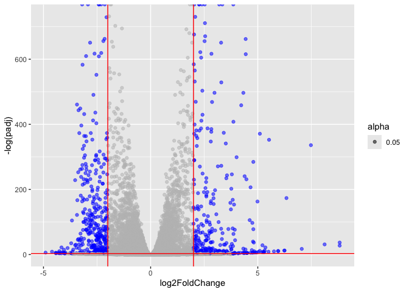
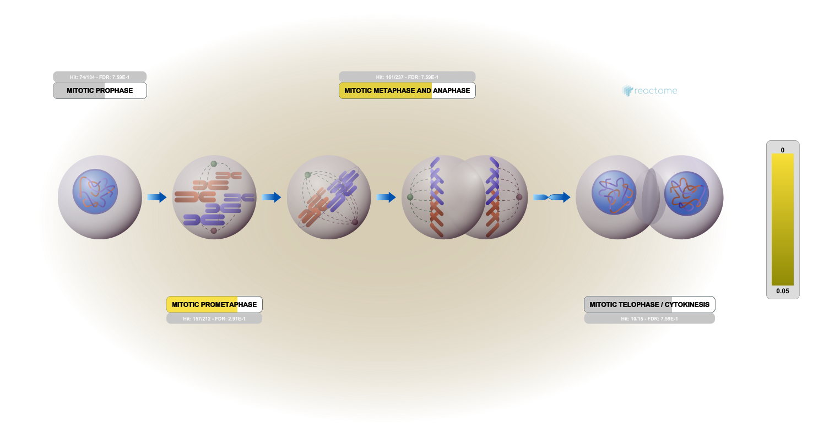

# Class 13: RNAseq mini project
Emily Chase (PID A14656894)

- [Background](#background)
- [Data import](#data-import)
- [Setup for DESeq](#setup-for-deseq)
- [Get results](#get-results)
- [Add annotation](#add-annotation)
- [Visualize results](#visualize-results)
- [GO analysis](#go-analysis)
  - [Reactome](#reactome)
- [Save results](#save-results)

## Background

Today we will run through a complete RNAseq analysis pipeline.

The data for comes from GEO entry: GSE37704, which is associated with
the following publication:

Trapnell C, Hendrickson DG, Sauvageau M, Goff L et al. “Differential
analysis of gene regulation at transcript resolution with RNA-seq”. Nat
Biotechnol 2013 Jan;31(1):46-53. PMID: 23222703

The authors report on differential analysis of lung fibroblasts in
response to loss of the developmental transcription factor HOXA1. Their
results and others indicate that HOXA1 is required for lung fibroblast
and HeLa cell cycle progression. In particular their analysis show that
“loss of HOXA1 results in significant expression level changes in
thousands of individual transcripts, along with isoform switching events
in key regulators of the cell cycle”. For our session we have used their
Sailfish gene-level estimated counts and hence are restricted to
protein-coding genes only.

## Data import

``` r
counts <- read.csv("GSE37704_featurecounts.csv", row.names = 1)
metadata <- read.csv("GSE37704_metadata.csv", )
```

Check correspondance of `metadata` and `counts`.

``` r
colnames(counts)
```

    [1] "length"    "SRR493366" "SRR493367" "SRR493368" "SRR493369" "SRR493370"
    [7] "SRR493371"

``` r
metadata
```

             id     condition
    1 SRR493366 control_sirna
    2 SRR493367 control_sirna
    3 SRR493368 control_sirna
    4 SRR493369      hoxa1_kd
    5 SRR493370      hoxa1_kd
    6 SRR493371      hoxa1_kd

Right now the metadata id’s and the counts columns are not a 1:1
correspondance.

``` r
colnames(counts) == metadata$id
```

    Warning in colnames(counts) == metadata$id: longer object length is not a
    multiple of shorter object length

    [1] FALSE FALSE FALSE FALSE FALSE FALSE FALSE

``` r
colnames(counts)[-1] == metadata$id
```

    [1] TRUE TRUE TRUE TRUE TRUE TRUE

Fix to remove that first “length” column of `counts`

``` r
counts <- counts[,-1]
head(counts, 3)
```

                    SRR493366 SRR493367 SRR493368 SRR493369 SRR493370 SRR493371
    ENSG00000186092         0         0         0         0         0         0
    ENSG00000279928         0         0         0         0         0         0
    ENSG00000279457        23        28        29        29        28        46

Also let’s remove low count genes

``` r
tot.counts <- rowSums(counts)
head(tot.counts)
```

    ENSG00000186092 ENSG00000279928 ENSG00000279457 ENSG00000278566 ENSG00000273547 
                  0               0             183               0               0 
    ENSG00000187634 
               1129 

``` r
hist(log(tot.counts),)
```


``` r
nonzero.inds <- tot.counts != 0
counts <- counts[nonzero.inds,]
```

``` r
# we can reuse this logical in the future
test_cols <- !all(colnames(counts) == metadata$id)
if (test_cols){
  message("there's an error")
} else {
  message("no error")
}
```

    no error

## Setup for DESeq

``` r
library(DESeq2)
```

    Warning: package 'DESeq2' was built under R version 4.5.2

    Loading required package: S4Vectors

    Loading required package: stats4

    Loading required package: BiocGenerics

    Loading required package: generics


    Attaching package: 'generics'

    The following objects are masked from 'package:base':

        as.difftime, as.factor, as.ordered, intersect, is.element, setdiff,
        setequal, union


    Attaching package: 'BiocGenerics'

    The following objects are masked from 'package:stats':

        IQR, mad, sd, var, xtabs

    The following objects are masked from 'package:base':

        anyDuplicated, aperm, append, as.data.frame, basename, cbind,
        colnames, dirname, do.call, duplicated, eval, evalq, Filter, Find,
        get, grep, grepl, is.unsorted, lapply, Map, mapply, match, mget,
        order, paste, pmax, pmax.int, pmin, pmin.int, Position, rank,
        rbind, Reduce, rownames, sapply, saveRDS, table, tapply, unique,
        unsplit, which.max, which.min


    Attaching package: 'S4Vectors'

    The following object is masked from 'package:utils':

        findMatches

    The following objects are masked from 'package:base':

        expand.grid, I, unname

    Loading required package: IRanges

    Loading required package: GenomicRanges

    Loading required package: Seqinfo

    Loading required package: SummarizedExperiment

    Loading required package: MatrixGenerics

    Loading required package: matrixStats


    Attaching package: 'MatrixGenerics'

    The following objects are masked from 'package:matrixStats':

        colAlls, colAnyNAs, colAnys, colAvgsPerRowSet, colCollapse,
        colCounts, colCummaxs, colCummins, colCumprods, colCumsums,
        colDiffs, colIQRDiffs, colIQRs, colLogSumExps, colMadDiffs,
        colMads, colMaxs, colMeans2, colMedians, colMins, colOrderStats,
        colProds, colQuantiles, colRanges, colRanks, colSdDiffs, colSds,
        colSums2, colTabulates, colVarDiffs, colVars, colWeightedMads,
        colWeightedMeans, colWeightedMedians, colWeightedSds,
        colWeightedVars, rowAlls, rowAnyNAs, rowAnys, rowAvgsPerColSet,
        rowCollapse, rowCounts, rowCummaxs, rowCummins, rowCumprods,
        rowCumsums, rowDiffs, rowIQRDiffs, rowIQRs, rowLogSumExps,
        rowMadDiffs, rowMads, rowMaxs, rowMeans2, rowMedians, rowMins,
        rowOrderStats, rowProds, rowQuantiles, rowRanges, rowRanks,
        rowSdDiffs, rowSds, rowSums2, rowTabulates, rowVarDiffs, rowVars,
        rowWeightedMads, rowWeightedMeans, rowWeightedMedians,
        rowWeightedSds, rowWeightedVars

    Loading required package: Biobase

    Welcome to Bioconductor

        Vignettes contain introductory material; view with
        'browseVignettes()'. To cite Bioconductor, see
        'citation("Biobase")', and for packages 'citation("pkgname")'.


    Attaching package: 'Biobase'

    The following object is masked from 'package:MatrixGenerics':

        rowMedians

    The following objects are masked from 'package:matrixStats':

        anyMissing, rowMedians

``` r
dds <- DESeqDataSetFromMatrix(countData=counts, 
                              colData = metadata,
                              design = ~condition)
```

    Warning in DESeqDataSet(se, design = design, ignoreRank): some variables in
    design formula are characters, converting to factors

``` r
dds <- DESeq(dds)
```

    estimating size factors

    estimating dispersions

    gene-wise dispersion estimates

    mean-dispersion relationship

    final dispersion estimates

    fitting model and testing

## Get results

``` r
res <- results(dds)
head(res,3)
```

    log2 fold change (MLE): condition hoxa1 kd vs control sirna 
    Wald test p-value: condition hoxa1 kd vs control sirna 
    DataFrame with 3 rows and 6 columns
                     baseMean log2FoldChange     lfcSE       stat      pvalue
                    <numeric>      <numeric> <numeric>  <numeric>   <numeric>
    ENSG00000279457   29.9136       0.179257 0.3248215   0.551863 5.81042e-01
    ENSG00000187634  183.2296       0.426457 0.1402658   3.040350 2.36304e-03
    ENSG00000188976 1651.1881      -0.692720 0.0548465 -12.630156 1.43993e-36
                           padj
                      <numeric>
    ENSG00000279457 6.86555e-01
    ENSG00000187634 5.15718e-03
    ENSG00000188976 1.76553e-35

## Add annotation

``` r
library("AnnotationDbi")
library("org.Hs.eg.db")
```

``` r
res$entrezid <- mapIds(org.Hs.eg.db, 
                     keys=row.names(res), 
                     keytype="ENSEMBL",        
                     column="ENTREZID",         
                     multiVals="first") 
```

    'select()' returned 1:many mapping between keys and columns

``` r
head(res$entrezid)
```

    ENSG00000279457 ENSG00000187634 ENSG00000188976 ENSG00000187961 ENSG00000187583 
                 NA        "148398"         "26155"        "339451"         "84069" 
    ENSG00000187642 
            "84808" 

## Visualize results

``` r
library(ggplot2)
```

    Warning: package 'ggplot2' was built under R version 4.5.2

``` r
mycols <- rep("gray", nrow(res))
mycols[abs(res$log2FoldChange) >= 2 & res$padj<0.05] <- "blue"

ggplot(res) + aes(x=log2FoldChange, y=-log(padj), alpha = 0.05) + geom_point(col=mycols) + geom_vline(xintercept=c(-2, 2), col="red") + geom_hline(yintercept=-log(0.05), col="red")
```

    Warning: Removed 1237 rows containing missing values or values outside the scale range
    (`geom_point()`).



\##Pathway analysis

``` r
library(gage)
```

``` r
library(gageData)
library(pathview)
```

    ##############################################################################
    Pathview is an open source software package distributed under GNU General
    Public License version 3 (GPLv3). Details of GPLv3 is available at
    http://www.gnu.org/licenses/gpl-3.0.html. Particullary, users are required to
    formally cite the original Pathview paper (not just mention it) in publications
    or products. For details, do citation("pathview") within R.

    The pathview downloads and uses KEGG data. Non-academic uses may require a KEGG
    license agreement (details at http://www.kegg.jp/kegg/legal.html).
    ##############################################################################

``` r
data(kegg.sets.hs)

# Examine the first 2 pathways in this kegg set for humans
head(kegg.sets.hs, 2)
```

    $`hsa00232 Caffeine metabolism`
    [1] "10"   "1544" "1548" "1549" "1553" "7498" "9"   

    $`hsa00983 Drug metabolism - other enzymes`
     [1] "10"     "1066"   "10720"  "10941"  "151531" "1548"   "1549"   "1551"  
     [9] "1553"   "1576"   "1577"   "1806"   "1807"   "1890"   "221223" "2990"  
    [17] "3251"   "3614"   "3615"   "3704"   "51733"  "54490"  "54575"  "54576" 
    [25] "54577"  "54578"  "54579"  "54600"  "54657"  "54658"  "54659"  "54963" 
    [33] "574537" "64816"  "7083"   "7084"   "7172"   "7363"   "7364"   "7365"  
    [41] "7366"   "7367"   "7371"   "7372"   "7378"   "7498"   "79799"  "83549" 
    [49] "8824"   "8833"   "9"      "978"   

``` r
foldchanges <- res$log2FoldChange
names(foldchanges) <- res$entrezid
head(foldchanges)
```

           <NA>      148398       26155      339451       84069       84808 
     0.17925708  0.42645712 -0.69272046  0.72975561  0.04057653  0.54281049 

``` r
keggres = gage(foldchanges, gsets=kegg.sets.hs)
head(keggres$less)
```

                                                      p.geomean stat.mean
    hsa04110 Cell cycle                            8.995727e-06 -4.378644
    hsa03030 DNA replication                       9.424076e-05 -3.951803
    hsa05130 Pathogenic Escherichia coli infection 1.405864e-04 -3.765330
    hsa03013 RNA transport                         1.246882e-03 -3.059466
    hsa03440 Homologous recombination              3.066756e-03 -2.852899
    hsa04114 Oocyte meiosis                        3.784520e-03 -2.698128
                                                          p.val       q.val
    hsa04110 Cell cycle                            8.995727e-06 0.001889103
    hsa03030 DNA replication                       9.424076e-05 0.009841047
    hsa05130 Pathogenic Escherichia coli infection 1.405864e-04 0.009841047
    hsa03013 RNA transport                         1.246882e-03 0.065461280
    hsa03440 Homologous recombination              3.066756e-03 0.128803765
    hsa04114 Oocyte meiosis                        3.784520e-03 0.132458190
                                                   set.size         exp1
    hsa04110 Cell cycle                                 121 8.995727e-06
    hsa03030 DNA replication                             36 9.424076e-05
    hsa05130 Pathogenic Escherichia coli infection       53 1.405864e-04
    hsa03013 RNA transport                              144 1.246882e-03
    hsa03440 Homologous recombination                    28 3.066756e-03
    hsa04114 Oocyte meiosis                             102 3.784520e-03

``` r
pathview(gene.data=foldchanges, pathway.id="hsa04110")
```

    'select()' returned 1:1 mapping between keys and columns

    Info: Working in directory /Users/emilychase/Desktop/phd/bggn213/bggn213_github/class13_RNAseqminiproj

    Info: Writing image file hsa04110.pathview.png


## GO analysis

``` r
data(go.sets.hs)
data(go.subs.hs)

# focus on biological process subset of GO

gobpsets <- go.sets.hs[go.subs.hs$BP]
gobpres <- gage(foldchanges, gsets=gobpsets)
```

``` r
head(gobpres$less)
```

                                                p.geomean stat.mean        p.val
    GO:0048285 organelle fission             1.536227e-15 -8.063910 1.536227e-15
    GO:0000280 nuclear division              4.286961e-15 -7.939217 4.286961e-15
    GO:0007067 mitosis                       4.286961e-15 -7.939217 4.286961e-15
    GO:0000087 M phase of mitotic cell cycle 1.169934e-14 -7.797496 1.169934e-14
    GO:0007059 chromosome segregation        2.028624e-11 -6.878340 2.028624e-11
    GO:0000236 mitotic prometaphase          1.729553e-10 -6.695966 1.729553e-10
                                                    q.val set.size         exp1
    GO:0048285 organelle fission             5.841698e-12      376 1.536227e-15
    GO:0000280 nuclear division              5.841698e-12      352 4.286961e-15
    GO:0007067 mitosis                       5.841698e-12      352 4.286961e-15
    GO:0000087 M phase of mitotic cell cycle 1.195672e-11      362 1.169934e-14
    GO:0007059 chromosome segregation        1.658603e-08      142 2.028624e-11
    GO:0000236 mitotic prometaphase          1.178402e-07       84 1.729553e-10

### Reactome

Some folks really like Reactome online (ie their webpage viewer) rather
than the R package of the same name (can get from bioconductor).

To use the website viewer we want to upload our set of gene symbols for
the genes we want to focus on (here those with a P-value\<0.05)

``` r
res$symbol <- mapIds(org.Hs.eg.db, 
                     keys=row.names(res), 
                     keytype="ENSEMBL",        
                     column="SYMBOL",         
                     multiVals="first") 
```

    'select()' returned 1:many mapping between keys and columns

``` r
head(res$symbol)
```

    ENSG00000279457 ENSG00000187634 ENSG00000188976 ENSG00000187961 ENSG00000187583 
                 NA        "SAMD11"         "NOC2L"        "KLHL17"       "PLEKHN1" 
    ENSG00000187642 
            "PERM1" 

``` r
sig_genes <- res[res$padj <= 0.05 & !is.na(res$padj), "symbol"]
write.table(sig_genes, file="significant_genes.txt", row.names=FALSE, col.names=FALSE, quote=FALSE)
```

Then, to perform pathway analysis online go to the Reactome website
(https://reactome.org/PathwayBrowser/#TOOL=AT). Select “choose file” to
upload your significant gene list. Then, select the parameters “Project
to Humans”, then click “Analyze”.



## Save results

``` r
write.csv(res, file="myresults_annotated.csv")

#another option
# save(res, file="my_results.RData") #save as an R object to be loaded back into R
```
